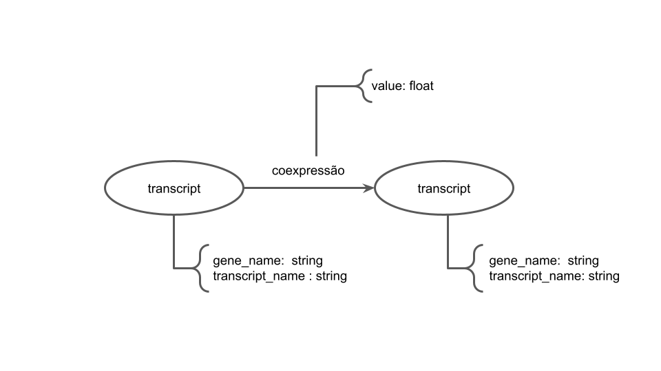

# Projeto `Clusters de coexpressão gênica em pacientes com câncer de próstata com e sem obesidade: impactos na progressão tumoral`
# Project `Gene Expression Clusters in Prostate Cancer Patients With and Without Obesity: Impacts on Tumor Progression`

# Descrição Resumida do Projeto

A obesidade é uma condição metabólica caracterizada pelo acúmulo excessivo de gordura corporal, especialmente a visceral, e está associada a inflamação crônica, alterações hormonais e disfunções metabólicas. Essa condição tem se tornado um dos maiores problemas de saúde pública no mundo, com projeções de crescimento alarmantes nas próximas décadas.

O câncer de próstata, por sua vez, é o tumor maligno mais frequente em homens no Brasil depois do câncer de pele não melanoma e apresenta elevada taxa de mortalidade. O desenvolvimento e a progressão da doença envolvem múltiplos fatores de risco, incluindo idade, hereditariedade, dieta e estilo de vida.

Diversos estudos indicam que a obesidade influencia negativamente a biologia tumoral da próstata, promovendo maior agressividade, risco de recidiva e mortalidade específica. Esse efeito ocorre por meio da liberação de adipocinas inflamatórias, alterações na sinalização hormonal (como o aumento da aromatização da testosterona em estradiol) e modificações no microambiente tumoral.

A proposta deste projeto é analisar dados de expressão gênica de pacientes com câncer de próstata obesos e não obesos, construindo redes de coexpressão para identificar clusters de genes, hubs e vias biológicas associadas à progressão tumoral. Essa abordagem permitirá compreender como a obesidade reprograma o transcriptoma prostático.

# Slides

[Slides PDF](https://github.com/datasciforhealth/datasci4health/raw/main/project1/assets/slides/Slides%20Clusters%20de%20express%C3%A3o%20g%C3%AAnica%20em%20pacientes%20com%20c%C3%A2ncer%20de%20pr%C3%B3stata%20com%20e%20sem%20obesidade%20impactos%20na%20progress%C3%A3o%20tumoral.pdf)

# Fundamentação Teórica

- O câncer de próstata (CaP) é a neoplasia mais incidente em homens no Brasil, apresentando fatores de risco como idade, histórico familiar e etnia (INCA, 2022) [[1]](#1).  
- Evidências recentes indicam que a obesidade é um importante modulador da progressão do CaP, associada a tumores mais agressivos e maior mortalidade (Avgerinos et al., 2019; Cao & Ma, 2011) [[2]](#2), [[3]](#3).  
- A obesidade, além de alterar o metabolismo sistêmico, promove inflamação crônica e desregulação hormonal por meio da secreção de adipocinas, citocinas inflamatórias e do aumento da conversão de testosterona em estradiol no tecido adiposo (Liermann-Wooldrik et al., 2024) [[4]](#4). Esses mecanismos contribuem para a instabilidade genômica e maior agressividade tumoral.  

Portanto, investigar como a obesidade impacta o microambiente prostático por meio da análise da expressão gênica diferencial é fundamental para esclarecer os mecanismos envolvidos na progressão do CaP e apontar possíveis alvos para intervenção terapêutica.  

---

# Perguntas de Pesquisa

Quais genes são diferencialmente expressos entre tumores de pacientes com câncer de próstata obesos/sobrepeso e tumores de pacientes normopeso, e como os perfis de expressão destes genes se associam a parâmetros clínicos de progressão tumoral?

__Hipóteses__
- A obesidade altera o padrão de expressão gênica em tumores de pacientes com câncer de próstata, resultando em um conjunto distinto de genes diferencialmente expressos entre obesos/sobrepeso e normopeso.

- Os genes diferencialmente expressos em tumores de pacientes obesos/sobrepeso estarão enriquecidos em vias relacionadas à inflamação, ao metabolismo e ao remodelamento do microambiente tumoral.

- Um score de assinatura derivado dos genes diferencialmente expressos estará associado a pior prognóstico clínico (p. ex. maiores escores de Gleason, estádios mais avançados e menor sobrevida livre de progressão).

# Bases de Dados

Base de Dados | Endereço na Web | Resumo descritivo
----- | ----- | -----
Gene Expression Omnibus (GEO) | https://www.ncbi.nlm.nih.gov/gds | Base pública do NCBI que armazena dados de expressão gênica e outros experimentos de alto rendimento, permitindo acesso a estudos de transcriptômica em diversas condições biológicas e doenças.
The Cancer Genome Atlas Program (TCGA) | https://portal.gdc.cancer.gov/ | Consórcio internacional que reúne dados multi-ômicos de diferentes tipos de câncer, incluindo genômica, transcriptômica, epigenética e clínica, para apoiar a pesquisa em oncologia e medicina de precisão.

# Modelo Lógico

> 

# Metodologia
1. Busca em bases de dados por coexpressão de transcritos coletados de indivíduos obesos com e sem câncer de próstata.

2. Identificação de coexpressões relevantes entre os transcritos.

3. Construção de uma rede de interação entre esses transcritos para pacientes com câncer de próstata com e sem obesidade.

4. Análise da topologia da rede para determinar a centralidade dos nós e a presença de hubs e comunidades.

5. Comparação das redes e identificação de transcritos candidatos a biomarcadores.

6. Análise de enriquecimento de vias para identificar quais transcritos candidatos apresentam expressão significativa em vias de interesse.

7. Correlação desses biomarcadores no contexto do desenvolvimento do câncer de próstata.

# Ferramentas
- Cytoscape
- RStudio
- STRING
# Referências Bibliográficas

<a id="1">[1]</a> INCA. Instituto Nacional de Câncer. *Estimativa 2022: Incidência de Câncer no Brasil*. Rio de Janeiro: INCA; 2022. Disponível em: [https://www.inca.gov.br](https://www.inca.gov.br)  

<a id="2">[2]</a> Avgerinos KI, Spyrou N, Mantzoros CS, Dalamaga M. Obesity and cancer risk: Emerging biological mechanisms and perspectives. *Metabolism*. 2019;92:121-135. [https://doi.org/10.1016/j.metabol.2018.11.001](https://doi.org/10.1016/j.metabol.2018.11.001)  

<a id="3">[3]</a> Cao Y, Ma J. Body mass index, prostate cancer–specific mortality, and biochemical recurrence: a systematic review and meta-analysis. *Cancer Prev Res*. 2011;4(4):486-501. [https://doi.org/10.1158/1940-6207.CAPR-10-0229](https://doi.org/10.1158/1940-6207.CAPR-10-0229)  

<a id="4">[4]</a> Liermann-Wooldrik C, et al. Obesity-driven mechanisms in prostate cancer progression. *Front Oncol*. 2024;14. [https://doi.org/10.3390/ijms252212137] 
