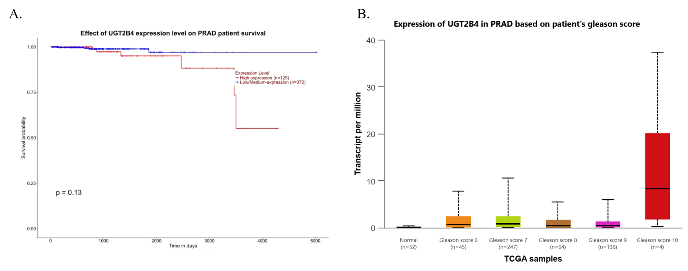

# Projeto `Clusters de coexpressão gênica em pacientes com câncer de próstata com e sem obesidade: Impactos na progressão tumoral`
# Project `Gene Expression Clusters in Prostate Cancer Patients With and Without Obesity: Impacts on Tumor Progression`

# Descrição Resumida do Projeto

**Contextualização do Projeto**

Este projeto investiga como a obesidade modula as redes de expressão gênica no câncer de próstata, com o objetivo de identificar assinaturas moleculares associadas a tumores mais agressivos e ao pior prognóstico clínico. Para contextualizar, o câncer de próstata é um dos mais incidentes e letais entre os homens no Brasil, enquanto a obesidade atinge níveis epidêmicos globalmente, estabelecendo um cenário de relevância clínica e de saúde pública.

**Motivação**

No que se refere ao problema de pesquisa, a relação entre obesidade e câncer de próstata é complexa, uma vez que evidências apontam que a obesidade não aumenta necessariamente o risco de desenvolver a doença, mas sim está consistentemente associada a formas mais agressivas e a uma maior mortalidade. Diante disso, a motivação central deste trabalho foi compreender os mecanismos moleculares pelos quais a obesidade influencia a progressão do câncer de próstata, o que é crucial para identificar novos alvos terapêuticos e estratégias de tratamento personalizado. 

**Relevância**

Em termos de relevância, este estudo busca preencher uma lacuna no conhecimento, conectando um fator de risco modificável (obesidade) a alterações moleculares específicas no tumor, o que tem potencial impacto no prognóstico e na resposta terapêutica. Alinhado a isso, trabalhos relacionados, baseados em grandes coortes, já demonstram uma correlação positiva entre IMC elevado e mortalidade por câncer de próstata, sugerindo uma interface metabólica e inflamatória na progressão da doença.   

**Trabalhos Relacionados**

O projeto apoia-se em estudos que descrevem a influência da obesidade sobre o microambiente tumoral e a expressão de genes relacionados ao metabolismo e inflamação (SAHA; KOLONIN; DIGIOVANNI, 2023; FERRO et al., 2017). Pesquisas recentes também relacionam o papel do citocromo P450, metabolismo do retinol e regulação de miRNAs à progressão tumoral em contextos obesogênicos.

**Análise Proposta**

Quanto à análise proposta, utilizamos dados de transcriptoma de um estudo público (GSE79021), nos quais comparamos perfis de expressão gênica entre tumores de pacientes obesos e não obesos, seguindo para análises de redes de interação proteica, enriquecimento funcional e validação em bases de dados como TCGA e DepMap.

**Resultados Alcançados**

Por fim, em relação aos principais resultados, identificou-se um perfil molecular distinto em tumores de pacientes obesos, com destaque para o gene UGT2B4, que se mostrou superexpresso e associado a maior agressividade tumoral e pior sobrevida. Ademais, análises funcionais validadas publicamente corroboram seu papel potencial como biomarcador e alvo terapêutico, consolidando a importância das assinaturas moleculares relacionadas à obesidade no contexto do câncer de próstata.

# Slides

[PDF Slides](assets/slides/Gene-Expression-Networks-in-Prostate-Cancer-With-and-Without-Obesity_.pdf)

# Fundamentação Teórica

## Câncer de Próstata

O câncer de próstata (CaP) é o mais incidente e o de maior mortalidade em homens no Brasil, depois dos cânceres de pele não-melanoma. Dados do Instituto Nacional do Câncer (INCA, 2022) revelam que para este triênio (2023-2025), são estimados 71.730 novos casos de CaP no país, com um risco estimado de aproximadamente 67 novos casos a cada 100 mil habitantes (INCA,2022).

O processo de progressão do CaP é um processo muitas vezes silencioso e ocorre através de estágios definidos, iniciando com uma neoplasia intraepitelial prostática (PIN), evoluindo para um carcinoma *in situ*, até a evolução para um adenocarcinoma. A partir desse ponto pode haver metástase, sendo os linfonodos e ossos os principais locais para onde ocorre a metástase (Rebello *et al.*, 2021).

Dentre os fatores de risco associados a esta doença, destacam-se: a idade, importante marcador, uma vez que aproximadamente 75% dos novos casos ocorrem a partir dos 65 anos; hereditariedade com mutações no gene BRCA2 e a síndrome de Lynch; além de outros fatores, como etnia, exposição a agentes cancerígenos, radiação, desregulação hormonal e, por fim, obesidade e dieta. (INCA,2022).

## Obesidade

A obesidade é uma condição metabólica caracterizada pelo acúmulo excessivo de gordura corporal. Sua cauda é multifatorial, sendo as principais motivações a predisposição genética, distúrbios endócrinos, hábitos alimentares inadequados e o sedentarismo.

O diagnóstico clínico mais utilizado é o índice de massa corporal (IMC), calculado pela razão entre peso e altura (kg/m²), sendo considerado sobrepeso valores entre 25,0 e 29,9 kg/m², e obesidade valores iguais ou superiores a 30 kg/m² (WORLD HEALTH ORGANIZATION, 2000). Embora simples e amplamente adotado, o IMC não distingue entre massa magra e gorda, tampouco avalia a distribuição da gordura corporal. A gordura visceral, em especial, é o componente mais associado a riscos metabólicos e oncológicos (Bandini *et al.*, 2017; Khandekar *et al.*, 2011).

Estimativas recentes indicam que mais de 3,3 bilhões de pessoas poderão ser afetadas pela obesidade ou sobrepeso até 2035, representando um aumento superior a 50% em relação aos 2,2 bilhões estimados em 2020 (World Obesity Federation, 2022). No Brasil, esse cenário também é preocupante, no ano de 2025, aproximadamente 68% da população adulta do país vive com um alto IMC e 31% estão vivendo com obesidade segundo World Obesity Federation (2025). Projeções apontam um crescimento anual de 1,9 % em adultos e 1,8 % em criança (World Obesity Federation, 2024).

## Obesidade, Risco e Progressão do Câncer de Próstata  

A relação entre obesidade e câncer de próstata (CaP) é complexa, com achados na literatura sobre o risco de desenvolvimento da doença sendo conflitantes. Embora algumas evidências sugiram uma relação inversa com tumores de baixo grau, a associação mais consistente e clinicamente significativa é com a progressão e agressividade da neoplasia (SAHA; KOLONIN; DIGIOVANNI, 2023). 

Estudos prospectivos de grande porte demonstram uma correlação positiva entre o aumento do Índice de Massa Corporal (IMC) e a mortalidade por CaP (CALLE et al., 2003; RODRIGUEZ et al., 2001). Homens com obesidade grau 1 (IMC 30–34,9 kg/m²) e grau 2 (IMC 35,0–39,9 kg/m²) apresentaram um aumento de 20% e 34% na mortalidade, respectivamente, em comparação com homens com IMC normal (CALLE et al., 2003). A importância do ganho de peso na vida adulta é destacada por um estudo com cerca de 2.500 homens não fumantes, que mostrou que aqueles que ganharam entre 9 kg e 13 kg desde os 21 anos de idade tiveram um risco 30% maior de desenvolver a doença. Esse risco subiu para 50% naqueles que ganharam mais de 13 kg no mesmo período, em comparação com homens que mantiveram um peso estável. (DICKERMAN et al., 2017). Análises retrospectivas em coortes de pacientes submetidos à prostatectomia radical reforçam essa associação, vinculando o excesso de peso e a obesidade a uma maior mortalidade específica por CaP (VIDAL et al., 2017) e a um risco aumentado de progressão para a forma resistente à castração (KETO et al., 2012).

Diversos mecanismos são propostos para explicar essa ligação. A obesidade promove um ambiente local e sistêmico alterado pela liberação de fatores inflamatórios e hormonais, que podem impulsionar a agressividade tumoral (SAHA; KOLONIN; DIGIOVANNI, 2023). Além disso, pacientes com CaP e obesidade apresentam maior probabilidade de falha terapêutica. Evidências robustas mostram que o IMC elevado é um fator de risco para Recidiva Bioquímica (RB) após prostatectomia radical ou radioterapia. (TOREN; VENKATESWARAN, 2014; CAO; MA, 2011; SPANGLER et al., 2007). Um aumento de 5 kg/m² no IMC foi associado a um risco 21% maior de RB (RR 1,21; IC 95% 1,11–1,31) (CAO; MA, 2011). Estudos em radioterapia vinculam a obesidade não apenas à falha bioquímica, mas também a um maior risco de metástase à distância e mortalidade (WANG et al., 2015).

A raça também emerge como um fator modificador dessa relação. Estudos prospectivos indicam que o risco associado à obesidade é mais pronunciado em homens afro-americanos, possivelmente devido a efeitos biológicos mais intensos, como inflamação sistêmica, ou à interação com fatores genéticos específicos (BARRINGTON et al., 2015; CHORNOKUR et al., 2013; POWELL; BOLLIG-FISCHER, 2013).

# Perguntas de Pesquisa

A obesidade/sobrepeso promove alterações no perfil de expressão gênica em tumores de próstata, resultando na superexpressão de genes metabolicamente ativos que se associam a parâmetros de agressividade tumoral e pior prognóstico clínico.

**Hipóteses**
- A obesidade altera o padrão de expressão gênica em tumores de pacientes com câncer de próstata, resultando em um conjunto distinto de genes diferencialmente expressos entre obesos/sobrepeso e normopeso.
- Os genes diferencialmente expressos em tumores de pacientes obesos/sobrepeso estarão enriquecidos em vias relacionadas à inflamação, ao metabolismo e ao remodelamento do microambiente tumoral.
- Um score de assinatura derivado dos genes diferencialmente expressos estará associado a pior prognóstico clínico (p. ex. maiores escores de Gleason, estádios mais avançados e menor sobrevida livre de progressão).

# Metodologia

## Bases de Dados e Evolução

| Base de Dados | Endereço na Web | Resumo descritivo |
| :--- | :--- | :--- |
| Gene Expression Omnibus (GEO) | https://www.ncbi.nlm.nih.gov/gds | Base pública do NCBI que armazena dados de expressão gênica e outros experimentos de alto rendimento, permitindo acesso a estudos de transcriptômica em diversas condições biológicas e doenças. |
| KEGG | https://www.kegg.jp/kegg/pathway.html | KEGG é uma coleção de bancos de dados que tratam de genomas, vias biológicas, doenças, medicamentos e substâncias químicas. |
| DAVID | https://davidbioinformatics.nih.gov/ | O Banco de Dados para Anotação , Visualização e Descoberta Integrada (DAVID) fornece um conjunto abrangente de ferramentas de anotação funcional para ajudar a compreender o significado biológico de grandes listas de genes |
| SHINY GO | https://bioinformatics.sdstate.edu/go/ | Ferramenta gráfica para enriquecimento de conjuntos de genes em animais e plantas. |
| UALCAN | http://ualcan.path.uab.edu/ | Plataforma interativa para analisar dados de expressão de RNA e proteína de TCGA, além de dados de metilação. Utilizada para acesso e análise dos dados de expressão de UGT2B4 e miRNAs no contexto de PRAD. |
| DepMap Portal | https://depmap.org/portal/ | Recurso de dados de dependência celular (screenings de CRISPR-Cas9) em linhagens de câncer. Foi utilizado para obter os "Gene Effect scores" de UGT2B4 em linhagens de câncer de próstata |
| miRTarget | https://mirtarget.com/ | Ferramenta web para identificação de alvos de miRNA com valor prognóstico em câncer. Foi utilizada para identificar miRNAs potencialmente reguladores de UGT2B4. |
| The Cancer Genome Atlas (TCGA) | https://portal.gdc.cancer.gov/ | PProjeto que caracterizou molecularmente mais de 20.000 amostras de câncer primário e amostras normares correspondentes, incluindo o adenocarcinoma de próstata (PRAD). Foi utilizado para validação da expressão diferencial de UGT2B4. |

Os dados utilizados foram extraídos do estudo *“Gene expression profiling of human prostate tumors identifies chromatin remodeling as a molecular link between obesity and lethal prostate cancer”*. O accession number do dataset com as amostras é **GSE79021** sendo que os dados apresentam a expressão gênica de 20254 genes.

As amostras foram extraídas e criados, manualmente através do orange, quatro grupos. Dois grupos com tecido prostático tumoral de indivíduos obesos e não obesos, e outros dois grupos com tecido prostático saudável de indivíduos obesos e não obesos. O fator determinante para a amostra ser considerada de um indivíduido obeso foi um IMC maior ou igual a 30. Os quatro grupos criados ficaram com a seguinte distribuição:

| Grupo | Quantidade de Amostras |
| :--- | :--- |
| Normal não obeso | 46 |
| Normal obeso | 3 |
| Tumoral obeso | 10 |
| Tumoral não obeso | 143 |

## Modelo Lógico

> 

## Análises Realizadas

### Análises de geração dos genes diferencialmente expressos (DEGs)

Para responder as perguntas e hipóteses do projeto as expressões gênicas de cada grupo foram comparadas em termos de foldchange (log2FC) e pvalor (-log10(pvalue)). Dessa forma, foram criados 4 novos grupos de comparação, sendo a disposição dos grupos conforme a tabela a seguir.

| Grupo controle x Grupo experimental | Quantidade de Amostras |
| :--- | :--- |
| Normal não obeso x Normal obeso | 49 |
| Tumoral não obeso x Tumoral obeso | 153 |
| Normal não obeso x Tumoral não obeso | 189 |
| Normal obeso x Tumoral obeso | 13 |

Os genes mais expressos entre os grupos foram filtrados conforme os thresholds de 1.3 para o pvalor e 0.66 para o foldchange, gerando o seguinte quantitativo de genes selecionados:

| Grupo controle x Grupo experimental | Quantidade de Genes |
| :--- | :--- |
| Normal não obeso x Normal obeso | 88 |
| Tumoral não obeso x Tumoral obeso | 38 |
| Normal não obeso x Tumoral não obeso | 56 |
| Normal obeso x Tumoral obeso | 583 |

### Redes de interação proteína-proteína

A construção e análise das redes de interação proteína-proteína (PPI) seguiram um fluxo de trabalho padronizado. Inicialmente, a lista de genes diferencialmente expressos (DEGs) identificados e processados na plataforma Orange foi exportada. Esses genes foram subsequentemente submetidos à base de dados STRING para recuperar as interações proteicas conhecidas. A rede resultante de PPI foi então importada para o ambiente Cytoscape, onde uma análise topológica foi conduzida, focando em métricas de centralidade para caracterizar a importância dos nós dentro da rede.

### Enriquecimento funcional

Para a análise funcional dos genes diferencialmente expressos (DEGs), foi utilizado um arquivo .csv gerado no software Orange, contendo a lista de genes obtida a partir da comparação entre os grupos tumoral obeso e tumoral não obeso. Essa lista foi submetida à plataforma DAVID (Database for Annotation, Visualization, and Integrated Discovery), uma interface que integra bancos de dados biológicos e identifica categorias funcionais enriquecidas em conjuntos de genes, possibilitando a visualização de relações entre genes e vias biológicas.

A análise foi conduzida por meio da ferramenta **Functional Annotation Tool**, com foco na opção **Functional Annotation Clustering**, que agrupa categorias funcionais com base na similaridade de anotações e calcula um *enrichment score* para cada cluster. Em seguida, as vias mais relevantes foram analisadas individualmente por meio da categoria **KEGG_PATHWAY**, permitindo identificar os genes associados a cada rota metabólica e funcional.

Em paralelo, o **ShinyGO** foi empregado para gerar as visualizações gráficas dos resultados, como os barplots de enriquecimento, facilitando a interpretação das principais vias associadas aos genes.

### Análise de Validação em Bases de Dados Públicas	

Para validar os achados iniciais e investigar o potencial oncogênico dos genes identificados, realizou-se uma análise in silico integrando múltiplas bases de dados públicas. O perfil de expressão dos genes candidatos foi primeiramente avaliado utilizando a plataforma UALCAN com dados de transcriptômica do TCGA para adenocarcinoma de próstata (PRAD). 

Diante dos padrões de expressão observados, o gene UGT2B4 foi selecionado para investigações posteriores por apresentar características mais consistentes com um potencial alvo terapêutico, incluindo significativa superexpressão no tecido tumoral. Para caracterizar funcionalmente este gene, foram consultados dados de dependência celular do projeto DepMap, analisando-se scores de efeito gênico derivados de experimentos de CRISPR-Cas9. Complementarmente, conduziu-se uma análise de regulação por miRNAs através da ferramenta mirtargetLink para explorar mecanismos regulatórios pós-transcricionais. 

Esta abordagem metodológica permitiu uma validação abrangente do UGT2B4 como alvo de interesse no contexto do câncer de próstata. Todas as análises utilizaram dados transcriptômicos e genômicos publicamente disponíveis.

## Evolução do Projeto

A principal dificuldade inicial residiu na identificação de conjuntos de dados públicos que contivessem informações clínicas adequadas para a categorização dos grupos de estudo com base em índice de massa corporal (IMC) ou medidas morfométricas diretas (peso e altura). Apesar de existirem relatos na literatura sobre a utilização de dados de transcriptoma associados a IMC, tais conjuntos de dados não se encontravam disponíveis publicamente. Em uma tentativa de solucionar essa limitação, contatamos os autores correspondentes dos estudos identificados, porém não obtivemos resposta. Consequentemente, a pesquisa prosseguiu utilizando exclusivamente o conjunto de dados GSE79021, compreendendo aproximadamente 200 amostras. Cabe destacar que, na descrição original do estudo, os autores classificaram como "obesos" todos os pacientes com IMC ≥ 25, agrupando assim indivíduos com sobrepeso e obesidade em uma única categoria. Durante nossa análise, ao proceder com a estratificação adequada dos grupos, identificamos uma discrepância significativa na distribuição amostral entre os grupos obesos e não obesos nos diferentes subgrupos analisados.

Ao longo do desenvolvimento do projeto, os primeiros avanços ocorreram no entendimento e na organização dos dados de expressão gênica obtidos do GEO.   Essa etapa teve como objetivo identificar corretamente quais amostras pertenciam a pacientes obesos, não obesos, tumorais ou saudáveis, além de aplicar critérios estatísticos para selecionar apenas os genes que apresentavam alterações de expressão gênica significativas. Essa fase teve foco majoritariamente em conceitos computacionais, como filtragem de dados, padronização e preparação das bases para análises posteriores. 

Os dados foram inicialmente extraídos do site GEO pelo Rstudio, porém a quantidade de genes extraídos não era suficiente para uma análise adequada das relações entre os genes das diferentes amostras. Além disso, o threshold do foldchange teria que ser muito baixo (menor que 0.3) para que um número significativo de genes fosse considerado como expressivos. Para esta etapa final do trabalho o Orange foi utilizado, sendo que uma inversão de log2 foi aplicada no bloco de extração (GEO Soft Extractor) nos valores de expressão gênica de cada gene, posteriormente as amostras foram separadas manualmente. A aplicação da inversão de log2 fez com que um maior número de genes tivessem um valor de foldchange mais expressivo durante os cálculos. 

A decisão de utilizar a plataforma Orange para análise de dados ocorreu após discussão com o professor orientador, seguindo o feedback recebido na segunda entrega do projeto. Por meio dessa ferramenta, realizamos a estratificação manual dos quatro grupos experimentais previamente definidos. Adicionalmente, descobrimos durante o processo que o Orange permitia a análise integrada dos valores de p-value e fold-change através de volcano plots, método que foi incorporado ao fluxo de trabalho como uma solução prática e eficiente para nossa análise de genes diferencialmente expressos.

Com base na análise inicial dos dados, a comparação Tumor obeso versus Tumor não obeso foi selecionada para dar continuidade ao estudo, uma vez que esse contraste direto dentro do mesmo contexto tumoral permite isolar de forma mais específica o efeito da obesidade na progressão do câncer de próstata. Embora outras comparações tenham sido realizadas, como aquelas envolvendo tecido normal, esta abordagem elimina variáveis de confusão relacionadas a diferenças fundamentais entre tecidos normais e tumorais. Além disso, a relevância translacional do perfil molecular associado à obesidade no microambiente tumoral é particularmente significativa para a identificação de possíveis vias metabólicas ou alterações de expressão gênica que possam influenciar a agressividade da doença ou abrir perspectivas para intervenções terapêuticas direcionadas a pacientes obesos.

Em seguida, o projeto evoluiu para uma etapa mais analítica, na qual os genes selecionados foram utilizados para construir redes de interação. Nesse ponto, algoritmos de detecção de comunidades, medidas de centralidade e análise de grafos foram implementados como base de apoio ao entendimento do problema. Dessa forma, foi possível interpretar essas redes como sistemas complexos: os genes como “nós”, suas relações como “arestas” e as métricas computacionais auxiliando na identificação de quais elementos da rede são mais importantes. 

Com base nos resultados obtidos, a equipe de biologia se dedicou a investigar as questões centrais da pesquisa (descritas anteriormente) utilizando ferramentas de bioinformática. Para análises de enriquecimento funcional, foram empregadas plataformas consolidadas como o DAVID, complementadas por ferramentas modernas como ShinyGO. Adicionalmente, recursos como UALCAN e DepMap permitiram validar e aprofundar os achados em contextos clínicos e funcionais, enriquecendo substancialmente a compreensão dos mecanismos moleculares associados à obesidade no câncer de próstata.

# Ferramentas

**ORANGE**
O software foi utilizado para:
- extrair os dados do arquivo de extensão “.soft” baixado do site GEO
- separar os grupos experimentais e controle
- calcular o fold change e pvalor
- filtrar os genes diferencialmente expressos conforme os thresholds estabelecidos
- 
**STRING**
A plataforma foi utilizada para:
- recuperar as interações proteína-proteína (PPI) conhecidas a partir da lista de genes diferencialmente expressos.
- gerar a rede de interações iniciais que posteriormente foi exportada para análise.

**CYTOSCAPE**
O software foi empregado para:
- importar e visualizar a rede de interações proteicas obtida do STRING.
- realizar a análise topológica da rede utilizando métricas de centralidade.
- configurar a visualização da rede, onde:
   - O tamanho dos nós é proporcional ao seu degree (número de conexões).
   - A cor dos nós representa o valor de closeness centrality.

# Resultados

Diante dos quatro grupos comparativos inicialmente analisados, o foco do estudo foi direcionado para a comparação Tumor obeso versus Tumor não obeso. Esta escolha permitiu isolar o efeito da obesidade especificamente no contexto tumoral, minimizando variáveis de confusão e aumentando a relevância translacional dos resultados. Os achados decorrentes dessa análise são apresentados a seguir.

## Redes de interação gênica nos subgrupos analisados

As redes resultantes estão ilustradas nas Figuras 1 e 2. Nas figuras, cada nó representa um gene diferencialmente expresso (DEG) e as arestas representam interações proteicas (PPI) obtidas a partir da base STRING. A escala de cores dos nós indica o valor de *closeness centrality*, enquanto o tamanho do nó é proporcional ao *degree*, ou seja, ao número de conexões que o gene possui dentro da rede.

O fluxo de análise foi o seguinte:
1.  Os dados processados no Orange foram exportados.
2.  Os genes obtidos foram inseridos na base STRING para recuperar as interações proteína-proteína (PPI).
3.  Os resultados do STRING foram importados no Cytoscape, onde foi realizada a análise topológica, utilizando os principais indicadores de centralidade.

| Indicador de centralidade | Descrição | Interpretação estrutural na rede |
| :--- | :--- | :--- |
| **Degree** | Número de conexões diretas de cada nó. | Representa a conectividade local; nós com valores altos são considerados *hubs* ou nós muito conectados. |
| **Closeness Centrality** | Inverso da soma das distâncias do nó em relação aos demais. | Indica quão central está um gene dentro da rede ou quão eficientemente pode se conectar com outros. |
| **Betweenness Centrality** | Frequência com que um nó aparece nos caminhos mais curtos entre outros nós. | Mede a capacidade de um nó atuar como intermediário ou ponte entre diferentes partes da rede. |
| **Eigenvector Centrality** | Considera a importância dos nós conectados, além do número de conexões. | Avalia a influência global de um nó na rede, destacando aqueles conectados a outros nós relevantes. |

Entre eles, o *degree* e o *closeness* foram os principais parâmetros utilizados, uma vez que indicam, respectivamente, a importância local de um gene (número de interações diretas) e a eficiência global de comunicação dentro da rede.

## Comparação estrutural entre as redes analizadas

A análise de centralidade permitiu observar diferenças na estrutura e densidade das redes geradas para cada grupo comparativo:

### Tumor obeso vs tumor não obeso

Esta rede apresenta uma estrutura moderadamente simples, composta por dois pequenos módulos interligados.

* **Características estruturais:**
    * O primeiro módulo inclui os genes *VCAN*, *LUM*, *SULF1*, *EFEMP1* e *CSGALNACT1*, que formam um pequeno grupo conectado.
    * O segundo módulo é composto pelos genes *ADH1C*, *UGT2B4* e *UGT2B7*, conectados de forma linear.
* O tamanho dos nós representa o *degree* (número de conexões diretas), enquanto as cores refletem a *closeness centrality*.
* Não há conexões entre os dois módulos, o que indica baixa densidade global e ausência de interações entre os subgrupos.

> *Figura 1. Grafo gerado no Cytoscape: Tumor obeso vs tumor não obeso*

### Normal obeso vs normal não obeso

A rede mostra uma estrutura modular com um módulo central altamente interconectado e vários subgrupos periféricos com menor conectividade.

**Características estruturais:**
    * O módulo principal é composto pelos genes *IFI44*, *IFI44L*, *MX1*, *IFIT1*, *IFITM1*, *IFI6*, *IRF1*, *PLSCR1*, *PARP9* e *HERC6*, que formam uma rede densa de interações.
    * Pequenas sub-redes isoladas (*PPP2CB–PPM1B*, *PDK4–HADHA*, *LMNA–EMP1*, *B3GNT5–MUC3A*, *B3GAT3–CSGALNACT1*) indicam regiões locais de interação.

> *Figura 2. Grafo gerado no Cytoscape: Normal obeso vs normal no obeso*

Em conjunto, esses resultados mostram que as redes geradas apresentam diferentes graus de densidade e conectividade entre os grupos analisados. O uso dos indicadores de centralidade permitiu quantificar a importância estrutural dos nós dentro de cada rede.

## Enriquecimento

A análise de enriquecimento funcional realizada com os genes diferencialmente expressos entre tumores de pacientes obesos e não obesos revelou três vias KEGG como principais destaques: Metabolism of xenobiotics by cytochrome P450, Drug metabolism cytochrome P450 e Retinol metabolism (Figura 3). Essas vias foram selecionadas por apresentarem os maiores valores de enriquecimento (Fold Enrichment), os maiores valores de -log10 FDR e por compartilharem um conjunto de genes relevantes: UGT2B4, UGT2B7 e ADH1C.

Esses genes desempenham papéis distintos e complementares nas três vias: UGT2B7 e UGT2B4 atuam na glucuronidação de xenobióticos, hormônios e fármacos, regulando processos de detoxificação e metabolismo de drogas (Liu et al., 2023); já ADH1C participa da oxidação de álcoois e do retinol, sendo essencial para a formação de ácido retinoico e para a sinalização celular (Kropotova et al., 2014). 

> *Figura 3. Barplot das principais vias KEGG enriquecidas nos genes diferencialmente expressos (DEGs)*

### Metabolism of xenobiotics by cytochrome P450

A via de metabolismo de xenobióticos mediada pelo citocromo P450 (CYP) desempenha papel central na detoxificação de compostos exógenos e endógenos, influenciando processos celulares críticos no câncer de próstata. Evidências mostram que alterações na expressão e atividade de CYPs afetam o risco, a progressão e a resposta terapêutica do câncer de próstata (Maksymchuk, Kashuba, 2019; Mokhosoev *et al.*, 2024), especialmente em contextos de obesidade, onde fatores ambientais, dietéticos e metabólicos modulam ainda mais essa via (Ferro *et al.*, 2017). A obesidade pode alterar a expressão de CYPs, impactando o metabolismo de hormônios e carcinógenos, o que pode favorecer tumores mais agressivos e resistentes (Bankoglu, Stopper, 2022). Nesse cenário, a via CYP se destaca como elo entre fatores ambientais, genéticos e metabólicos no câncer de próstata, sendo possivelmente relevante em indivíduos obesos.

### Drug metabolism – cytochrome P450

Essa via representa uma subcategoria das rotas mediadas pelo citocromo P450 (CYP), com foco específico no metabolismo de fármacos. A expressão das enzimas da família CYP pode sofrer alterações significativas em tumores: a superexpressão pode levar à inativação acelerada de drogas antitumorais, favorecendo a resistência terapêutica, enquanto a expressão reduzida pode comprometer a transformação de pró-fármacos em suas formas ativas, diminuindo a eficácia do tratamento (Zhao *et al.*, 2021).

Esse desequilíbrio no metabolismo de fármacos pode impactar diretamente os resultados clínicos, especialmente em pacientes obesos, nos quais alterações inflamatórias e metabólicas influenciam a atividade das CYPs (Zarezadeh *et al.*, 2020). Dessa forma, a modulação da via de metabolismo de fármacos pelo citocromo P450 (CYP450) em tumores, particularmente em indivíduos obesos, pode afetar de maneira decisiva a farmacocinética, a eficácia e a resistência aos quimioterápicos (Pagoni, 2025).

### Retinol e metabolismo

O retinol e seus derivados, como o ácido retinoico, desempenham papéis fundamentais na diferenciação celular, proliferação e sinalização nuclear por meio dos receptores RAR/RXR, sendo essenciais para a homeostase epitelial e a função imunológica (Lavudi *et al.*, 2023). No câncer de próstata, a via RBP4–STRA6 facilita o transporte de retinol de adipócitos para células prostáticas, sustentando a plasticidade das células basais e favorecendo a adaptação tumoral (Xu *et al.*, 2025). Esse mecanismo tende a ser intensificado em indivíduos obesos, devido ao maior volume de tecido adiposo periprostático.

Em conjunto, essas as vias *Metabolism of xenobiotics by cytochrome P450*, *Drug metabolism cytochrome P450* e *Retinol metabolism* indicam um possível padrão funcional nos tumores de pacientes obesos, caracterizado por alterações em processos metabólicos, mecanismos de detoxificação e vias de sinalização celular. Os dados sugerem uma modulação dessas rotas em resposta ao contexto obesogênico, o que pode influenciar o microambiente tumoral.

## Análise de Validação em Bases de Dados Públicas

Para validar os achados iniciais de expressão e investigar o potencial oncogênico dos genes apontados no enriquecimento, conduzimos uma série de análises *in silico* utilizando bancos de dados genômicos e transcriptômicos publicamente disponíveis.

Para validar o padrão de expressão desses genes no contexto do câncer de próstata, utilizou-se a plataforma UALCAN, que disponibiliza dados de transcriptômica do TCGA. A análise do perfil de expressão de *UGT2B7* e *ADH1C* no conjunto de dados PRAD (Prostate Adenocarcinoma) mostrou que estes genes são, de fato, *downregulados* no tecido tumoral em comparação com o tecido normal, um padrão inconsistente com um potencial oncogene, o que os torna de pouco interesse para análise atual. Dada esta incongruência, o foco da investigação foi direcionado ao *UGT2B4*, que, pela mesma análise no UALCAN, demonstrou uma clara *upregulation* significativa no tecido tumoral primário, corroborando nosso conjunto de dados inicial e alinhando-se com um possível papel promotor de tumor conforme Figura 4.

> *Figura 4. Expressão de UGT2B4 em amostras normais.* Expressão diferencial de UGT2B4 no adenocarcinoma de próstata (PRAD) de acordo com o tipo de amostra. Dados do TCGA demonstram um aumento significativo na expressão de UGT2B4 (transcritos por milhão) em tumores primários (n=497) comparados ao tecido normal adjacente (n=52). Fonte: Portal UALCA

Aprofundando a caracterização do *UGT2B4*, os dados do TCGA via UALCAN ainda revelaram que a sua expressão correlaciona-se positivamente com a agressividade do tumor, sendo notavelmente mais elevada em pacientes com escores de Gleason mais altos. Do ponto de vista clínico, essa alta expressão mostrou estar associada a um pior prognóstico, com uma análise de sobrevida global indicando um *Hazard Ratio* (HR) superior a 1. O que pode ser visto nos gráficos abaixo.

> *Figura 5. Impacto Clínico da Expressão de UGT2B4* A) Análise de sobrevida global de pacientes com PRAD estratificada pela expressão de UGT2B4. B) Padrão de expressão de UGT2B4 em diferentes estágios de agressividade tumoral (escore de Gleason), mostrando correlação positiva entre expressão gênica e progressão da doença.

Para explorar o potencial do *UGT2B4* como um alvo terapêutico, foram consultados dados públicos de dependência celular gerados pelo projeto DepMap, os quais derivam de experimentos de alto rendimento de *knockout* com CRISPR. A interpretação dos "Gene Effect scores" indica que valores negativos significam que a inativação do gene compromete a viabilidade celular (Figura 6). Neste contexto, a maioria das linhagens de câncer de próstata analisadas apresentou scores negativos para *UGT2B4*. Especificamente, linhagens amplamente utilizadas como DU145, 22RV1, LNCaP e a linhagem de hiperplasia benigna BPH-1 exibiram os scores mais negativos, sugerindo uma forte dependência funcional da atividade de *UGT2B4*. Estes dados de consórcios independentes suportam a hipótese de que a inibição farmacológica do *UGT2B4* poderia ser uma estratégia terapêutica viável para subtipos de câncer de próstata.

> *Figura 6.  Ensaio de viabilidade após Knockout* - Score de efeito gênico (Gene Effect) de UGT2B4 em linhagens celulares de câncer de próstata. Valores negativos indicam que a inativação do gene compromete a viabilidade celular. Fonte: DepMap.

A fim de compreender os mecanismos que regulam a expressão de UGT2B4, uma análise in silico de regulação por miRNAs foi conduzida utilizando a ferramenta mirtarget. Os resultados indicaram que os miRNAs repressores de UGT2B4 encontram-se significativamente menos expressos nos tumores. Esta supressão de miRNAs inibidores efetivamente remove um mecanismo de controle pós-transcricional, permitindo a acumulação de UGT2B4. Este achado fornece uma explicação mecanística plausível para a upregulation observada (Figura 7 A-D).

> *Figura 7 Análise Integrada de Regulação e Impacto Clínico* - A) Expressão de UGT2B4 (Tumor vs. Normal) em múltiplos tipos de câncer (Pan-cancer). PRAD destaca-se com uma das maiores sobreregulações. B) Expressão dos 100 principais miRNAs reguladores de UGT2B4 (Tumor vs. Normal). Em PRAD, observa-se que estes miRNAs estão significativamente menos expressos nos tumores. C) Associação da expressão de UGT2B4 com a sobrevida global em diversos cânceres. D) Associação dos miRNAs reguladores de UGT2B4 com a sobrevida global.  Fonte das Figuras 4A-D: Plataforma GSCA.

Em síntese, este estudo identificou que o microambiente tumoral de pacientes obesos com câncer de próstata apresenta uma assinatura molecular única, caracterizada pela superexpressão de genes centrais ao metabolismo de xenobióticos e retinol. O gene *UGT2B4* destacou-se neste contexto, e análises de dados transcriptômicos e de dependência celular de domínio público validaram de forma convergente o seu papel na progressão do PRAD. Estas descobertas sugerem que a obesidade pode favorecer um contexto metabólico que seleciona para a superexpressão de *UGT2B4*, potencialmente contribuindo para uma biologia tumoral mais agressiva e abrindo perspectivas para o desenvolvimento de estratégias terapêuticas direcionadas.

# Discussão

A análise de expressão gênica realizada neste estudo revelou diferenças marcantes entre tumores de pacientes obesos e não obesos, sugerindo que a obesidade influencia significativamente os processos moleculares associados ao câncer de próstata. O conjunto de 38 genes diferencialmente expressos (DEGs) identificados na comparação entre tumores de indivíduos obesos e não obesos demonstra um padrão de regulação consistente com alterações em vias metabólicas e de detoxificação celular.

Entre as vias mais enriquecidas, destacaram-se Metabolism of xenobiotics by cytochrome P450, Drug metabolism – cytochrome P450 e Retinol metabolism. Essas rotas estão fortemente relacionadas ao metabolismo de compostos endógenos e exógenos e à regulação da homeostase celular. A presença dessas vias como destaque no grupo de tumores de pacientes obesos indica uma possível adaptação metabólica do tecido tumoral ao ambiente obesogênico, caracterizado por inflamação crônica, resistência insulínica e excesso de substratos lipídicos

A via do citocromo P450 (CYP), em particular, mostrou-se central para compreender o elo entre obesidade e progressão tumoral. A literatura demonstra que o aumento da atividade dessas enzimas pode modificar a resposta a fármacos e promover resistência terapêutica, além de alterar o metabolismo de hormônios esteroides e carcinógenos (Mokhosoev et al., 2024; Bankoglu & Stopper, 2022). Neste estudo, a modulação dessa via em tumores de pacientes obesos sugere que o microambiente metabólico alterado pela obesidade pode contribuir para o surgimento de fenótipos mais agressivos e refratários ao tratamento

Outro achado relevante foi a superexpressão do gene UGT2B4, corroborada por análises em bancos públicos (TCGA, UALCAN e DepMap). A expressão aumentada desse gene correlacionou-se positivamente com maior agressividade tumoral e pior prognóstico clínico, refletidos em maiores escores de Gleason e menor sobrevida global. Esses resultados indicam que o UGT2B4 pode atuar como um mediador metabólico-chave na ligação entre obesidade e progressão do câncer de próstata

A análise de dependência celular (DepMap) reforçou essa hipótese, ao demonstrar que linhagens prostáticas apresentam alta dependência funcional do UGT2B4, com “gene effect scores” negativos, indicando que sua inativação reduz a viabilidade celular. Além disso, a investigação de mecanismos regulatórios por miRNAs revelou supressão dos miRNAs inibidores de UGT2B4 em tumores, o que fornece uma explicação plausível para sua superexpressão e destaca um novo eixo regulatório potencialmente influenciado pelo estado metabólico

De modo geral, os resultados sustentam a hipótese inicial de que a obesidade induz alterações específicas no perfil de expressão gênica tumoral, ativando vias metabólicas relacionadas à biotransformação e ao metabolismo de retinoides, e promovendo um ambiente favorável à proliferação celular e à agressividade tumoral.

Esses achados estão em consonância com estudos anteriores que apontam para o papel da obesidade como fator modulador da progressão do câncer de próstata, especialmente em tumores andrógeno-dependentes (Saha, Kolonin & DiGiovanni, 2023; Ferro et al., 2017). No entanto, o presente estudo acrescenta evidências de que essa influência ocorre também por meio da reprogramação metabólica e da regulação pós-transcricional, aspectos pouco explorados na literatura.

# Conclusão

O presente estudo permitiu identificar uma assinatura molecular distinta associada à obesidade em pacientes com câncer de próstata. A análise de expressão gênica revelou que tumores de indivíduos obesos apresentam um perfil diferencial de genes superexpressos, destacando-se vias relacionadas ao metabolismo de xenobióticos, metabolismo de fármacos e metabolismo do retinol, todas mediadas pelo sistema citocromo P450. Essas vias desempenham papéis centrais na detoxificação, no processamento de compostos endógenos e exógenos e na modulação da resposta terapêutica, indicando um elo direto entre o estado metabólico e a agressividade tumoral.

Entre os genes identificados, UGT2B4 destacou-se como um elemento-chave, apresentando superexpressão significativa em tumores de pacientes obesos e associação direta com pior prognóstico clínico, como maiores escores de Gleason e menor sobrevida livre de progressão. As análises complementares em bases públicas (TCGA, UALCAN e DepMap) confirmaram a dependência funcional de linhagens tumorais desse gene, reforçando seu papel potencial como biomarcador e alvo terapêutico.

Além disso, observou-se que a regulação negativa de miRNAs inibidores de UGT2B4 pode explicar o aumento de sua expressão em contextos obesogênicos, sugerindo um mecanismo de desrepressão pós-transcricional que favorece a progressão tumoral. Esses achados apoiam a hipótese de que a obesidade atua como um modulador metabólico e genético, promovendo um microambiente tumoral mais agressivo e resistente a terapias convencionais.

Perguntas:

 A obesidade altera o padrão de expressão gênica em tumores de pacientes com câncer de próstata, resultando em um conjunto distinto de genes diferencialmente expressos entre obesos/sobrepeso e normopeso? 
   - Sim, foram encontrados DEGs entre os grupos tumorais obeso vs normopeso, o que nos mostra que há diferenças entre os grupos com obesidade quando comparados ao grupo normal.

Os genes diferencialmente expressos em tumores de pacientes obesos/sobrepeso estarão enriquecidos em vias relacionadas à inflamação, ao metabolismo e ao remodelamento do microambiente tumoral? 
   - Sim, no enriquecimento de vias pudemos ver que os DEGs que tiveram vias enriquecidas estavam majoritariamente envolvidos com vias do metabolismo.

Um score de assinatura derivado dos genes diferencialmente expressos estará associado a pior prognóstico clínico (p. ex. maiores escores de Gleason, estádios mais avançados e menor sobrevida livre de progressão)?
   - Sim, dentro do grupo de DEGs encontrados o gene UGT2B4 se destacou como um oncogene, tendo uma pior sobrevida dos pacientes quando há a superexpressão deste gene, além de que sua superexpressão ocorre de forma mais acentuada em pacientes com score de Gleason mais alto. 

# Trabalhos Futuros

Em um contexto com muito mais tempo e conhecimento poderíamos primeiramente saber como e onde buscar por dados mais robustos para a nossa pesquisa, com maior número de samples, integrando BMI e dados de prognóstico dos pacientes. A partir disso, acredito que para ser mais coerente com a disciplina poderíamos aprofundar mais no estudo e formação de clusters e de coexpressão dos genes. Além deste contexto, num mundo hipótetico poderiamos expandir o estudo com os seguintes passos:

1.  **Expansão do Estudo de Bioinformática**
    * **Meta-Análise com Mais Dados:** Agregar dados de transcriptoma de múltiplos conjuntos do GEO com informações de IMC para aumentar o poder estatístico e validar a associação entre obesidade e expressão de UGT2B4.
    * **Análise de Sobrevida Específica:** Investigar se a assinatura de expressão relacionada à obesidade (incluindo UGT2B4) prediz prognóstico em coortes públicas maiores de câncer de próstata.
    * **Análise de Regulação:** Usar ferramentas de bioinformática para explorar mecanismos de regulação do UGT2B4, como:
        * Fatores de transcrição ativados na obesidade que possam regulá-lo;
        * Padrões de metilação do seu promotor;
        * Interações com miRNAs em bancos de dados especializados;

2.  **Validação Experimental Direcionada**
    * **Validação em Amostras Independentes:** Confirmar os achados por RT-qPCR em um conjunto de amostras de tumor com IMC documentado.
    * **Estudo Funcional Básico:** Realizar *knockdown* de UGT2B4 com siRNA em linhagens dependentes (como 22RV1) e avaliar impacto na proliferação celular.
    * **Análise de Proteína:** Verificar por imuno-histoquímica se os níveis da proteína UGT2B4 se correlacionam com obesidade e agressividade tumoral.

3.  **Exploração de Mecanismos**
    * **Conexão com Metabolismo:** Investigar se metabólitos associados à obesidade (ácidos graxos, ácidos biliares) modulam a expressão de UGT2B4 em culturas celulares.
    * **Análise do Microambiente:** Usar ferramentas de deconvolução para examinar se a expressão de UGT2B4 se correlaciona com alterações no microambiente tumoral.

# Referências Bibliográficas

* BANKOGLU, E.; STOPPER, H. Obesity-related genomic instability and altered xenobiotic metabolism: possible consequences for cancer risk and chemotherapy. **Expert Reviews in Molecular Medicine**, v. 24, 2022. Disponível em: https://doi.org/10.1017/erm.2022.22. Acesso em: 1 nov. 2025.

* BARRINGTON, W. E. et al. Difference in association of obesity with prostate cancer risk between US African American and non-Hispanic white men in the selenium and vitamin E cancer prevention trial (SELECT). **JAMA Oncology**, v. 1, n. 3, p. 342–349, 2015.

* CALLE, E. E. et al. Overweight, obesity, and mortality from cancer in a prospectively studied cohort of U.S. adults. **New England Journal of Medicine**, v. 348, n. 17, p. 1625–1638, 2003.

* CAO, Y.; MA, J. Body mass index, prostate cancer-specific mortality, and biochemical recurrence: a systematic review and meta-analysis. **Cancer Prevention Research**, v. 4, n. 4, p. 486–501, 2011.

* CHANDRASHEKAR, D. S. et al. UALCAN: A Portal for Facilitating Tumor Subgroup Gene Expression and Survival Analyses. **Neoplasia**, New York, v. 19, n. 8, p. 649–658, 2017.

* CHORNOKUR, G. et al. Variation in HNF1B and obesity may influence prostate cancer risk in African American men: a pilot study. **Prostate Cancer**, v. 2013, p. 384594, 2013.

* DEPMAP. Cancer Dependency Map. [S. l.], 2024. Disponível em: https://depmap.org/portal/. Acesso em: 1 nov. 2025.

* DICKERMAN, B. A. et al. Weight change, obesity and risk of prostate cancer progression among men with clinically localized prostate cancer. **International Journal of Cancer**, v. 141, n. 5, p. 933–944, 2017.

* FERRO, M. et al. The emerging role of obesity, diet and lipid metabolism in prostate cancer. **Future Oncology**, v. 13, n. 3, p. 285–293, 2017. Disponível em: https://doi.org/10.2217/fon-2016-0217. Acesso em: 1 nov. 2025.

* KANEHISA, M.; GOTO, S. KEGG: Kyoto Encyclopedia of Genes and Genomes. **Nucleic Acids Research**, v. 28, n. 1, p. 27–30, 2000.

* KETO, C. J. et al. Obesity is associated with castration-resistant disease and metastasis in men treated with androgen deprivation therapy after radical prostatectomy: results from the SEARCH database. **BJU International**, v. 110, n. 4, p. 492–498, 2012.

* KROPOTOVA, E. S. et al. Altered expression of multiple genes involved in retinoic acid biosynthesis in human colorectal cancer. **Pathology & Oncology Research**, v. 20, n. 3, p. 707–717, 2014.

* LAVUDI, K. et al. Targeting the retinoic acid signaling pathway as a modern precision therapy against cancers. **Frontiers in Cell and Developmental Biology**, v. 11, 2023. Disponível em: https://doi.org/10.3389/fcell.2023.1254612. Acesso em: 1 nov. 2025.

* LIU, W. et al. The Uridine diphosphate (UDP)-glycosyltransferases (UGTs) superfamily: the role in tumor cell metabolism. **Frontiers in Oncology**, v. 12, 2023. Disponível em: https://doi.org/10.3389/fonc.2022.1088458. Acesso em: 17 nov. 2025.

* MAKSYMCHUK, O.; KASHUBA, V. Dietary lipids and environmental xenobiotics as risk factors for prostate cancer: The role of cytochrome P450. **Pharmacological Reports**, v. 71, p. 826–832, 2019. Disponível em: https://doi.org/10.1016/j.pharep.2019.04.011. Acesso em: 1 nov. 2025.

* MOKHOSOEV, I. et al. Human Cytochrome P450 Cancer-Related Metabolic Activities and Gene Polymorphisms: A Review. **Cells**, v. 13, 2024. Disponível em: https://doi.org/10.3390/cells13231958. Acesso em: 1 nov. 2025.

* NATIONAL CANCER INSTITUTE. The Cancer Genome Atlas (TCGA). Bethesda: National Institutes of Health, 2006. Disponível em: https://www.cancer.gov/ccg/research/genome-sequencing/tcga. Acesso em: 1 nov. 2025.

* PAGONI, M. et al. Integrated Pharmacogenetic Signature for the Prediction of Prostatic Neoplasms in Men With Metabolic Disorders. **Cancer Genomics & Proteomics**, v. 22, p. 285–305, 2025. Disponível em: https://doi.org/10.21873/cgp.20502. Acesso em: 1 nov. 2025.

* POWELL, I. J.; BOLLIG-FISCHER, A. Minireview: the molecular and genomic basis for prostate cancer health disparities. **Molecular Endocrinology**, v. 27, n. 6, p. 879–891, 2013.

* RODRIGUEZ, C. et al. Body mass index, height, and prostate cancer mortality in two large cohorts of adult men in the United States. **Cancer Epidemiology, Biomarkers & Prevention**, v. 10, n. 4, p. 345–352, 2001.

* ROKAVEC, M.; HERMEKING, H. miRTARGET: An integrated web tool for the identification of microRNA targets with potential therapeutic or prognostic value in cancer. **Neoplasia**, New York, v. 67, 2025. No prelo.

* SAHA, A.; KOLONIN, M. G.; DIGIOVANNI, J. Obesity and prostate cancer — microenvironmental roles of adipose tissue. **Nature Reviews Urology**, v. 20, p. 579–596, 2023. Disponível em: https://doi.org/10.1038/s41585-023-00764-9. Acesso em: 1 nov. 2025.

* SPANGLER, E. et al. Association of obesity with tumor characteristics and treatment failure of prostate cancer in African-American and European American men. **Journal of Urology**, v. 178, n. 5, p. 1939–1944, 2007.

* TOREN, P.; VENKATESWARAN, V. Periprostatic adipose tissue and prostate cancer progression: new insights into the tumor microenvironment. **Clinical Genitourinary Cancer**, v. 12, n. 1, p. 21–26, 2014.

* VIDAL, A. C. et al. Obesity and prostate cancer-specific mortality after radical prostatectomy: results from the Shared Equal Access Regional Cancer Hospital (SEARCH) database. **Prostate Cancer and Prostatic Diseases**, v. 20, n. 1, p. 72–78, 2017.

* WANG, L. S. et al. Impact of obesity on outcomes after definitive dose-escalated intensity-modulated radiotherapy for localized prostate cancer. **Cancer**, v. 121, n. 17, p. 3010–3017, 2015.

* XU, H. et al. Targeting RBP4-STRA6 retinol signaling disrupts adipose–prostate crosstalk: A novel strategy to suppress basal cell plasticity in androgen deprivation. **Metabolism: Clinical and Experimental**, 156288, 2025. Disponível em: https://doi.org/10.1016/j.metabol.2025.156288. Acesso em: 1 nov. 2025.

* ZAREZADEH, M. et al. The effect of obesity, macronutrients, fasting and nutritional status on drug-metabolizing cytochrome P450s: a systematic review of current evidence on human studies. **European Journal of Nutrition**, v. 60, p. 2905–2921, 2020. Disponível em: https://doi.org/10.1007/s00394-020-02421-y. Acesso em: 1 nov. 2025.

* ZHAO, M. J. et al. Cytochrome P450 Enzymes and Drug Metabolism in Humans. **International Journal of Molecular Sciences**, v. 22, 2021. Disponível em: https://doi.org/10.3390/ijms222312808. Acesso em: 1 nov. 2025.

