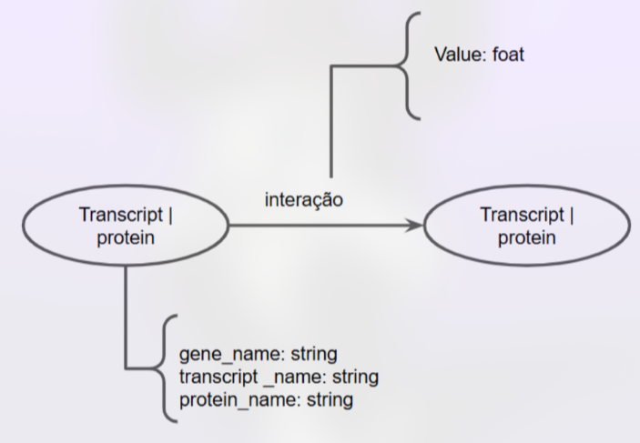
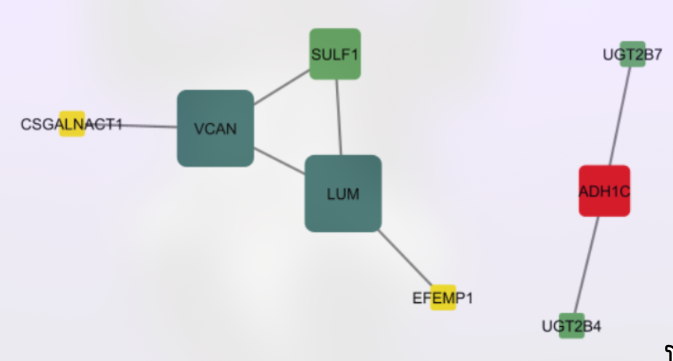
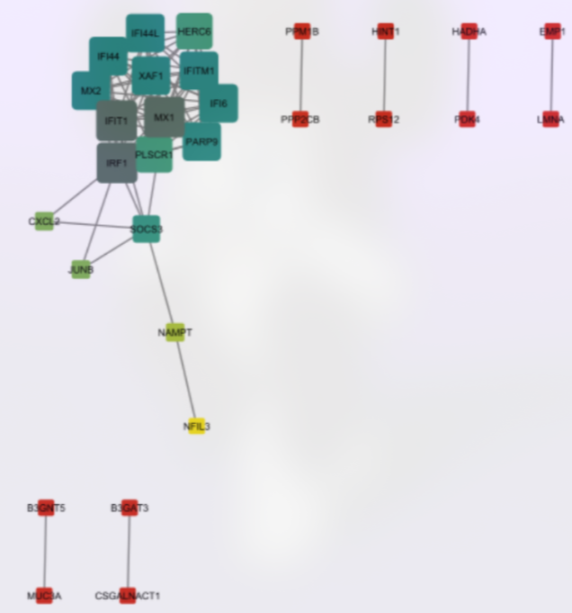
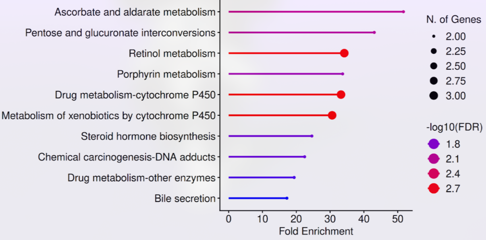
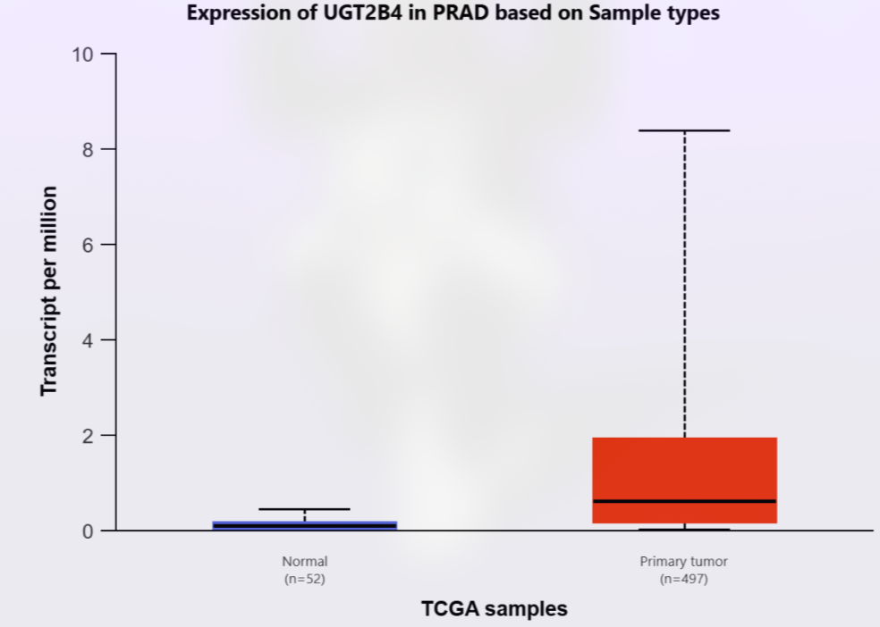
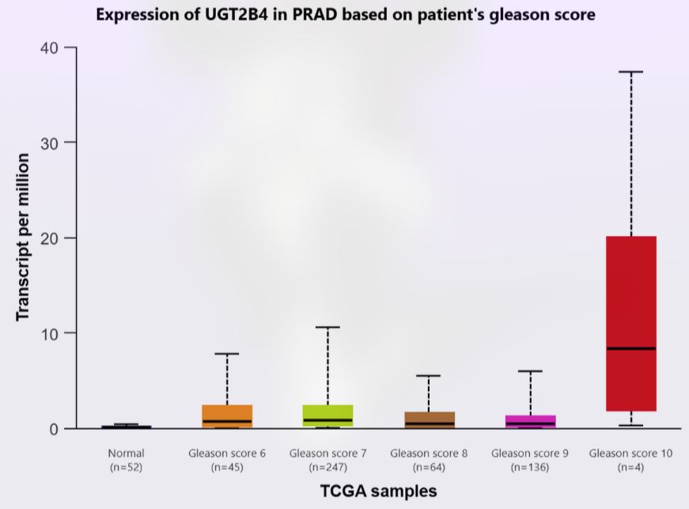
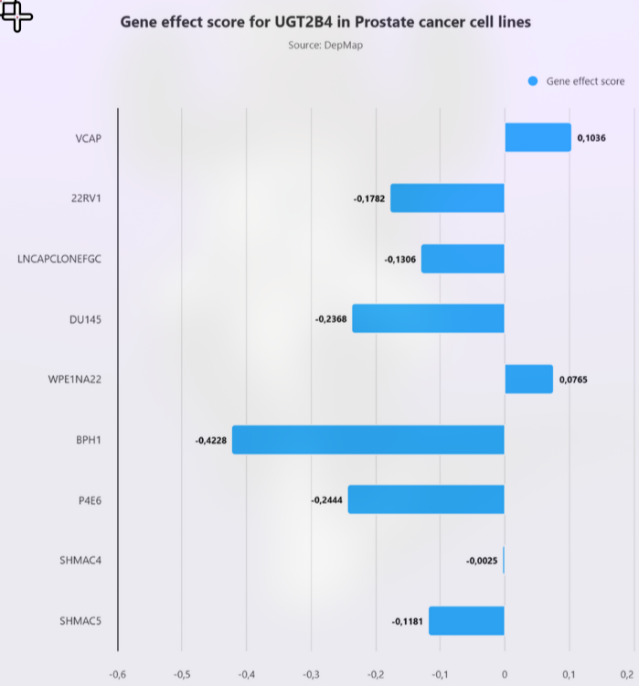
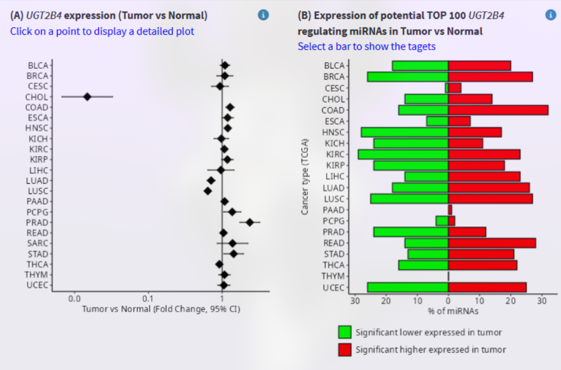
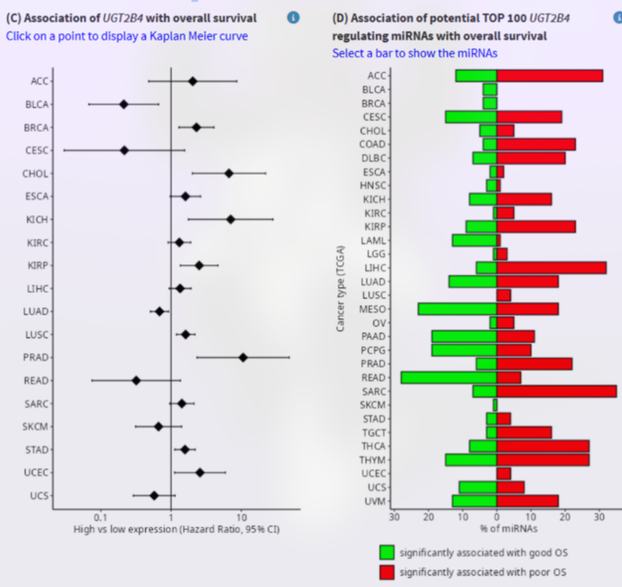

# Projeto `Clusters de coexpressão gênica em pacientes com câncer de próstata com e sem obesidade: impactos na progressão tumoral`
# Project `Gene Expression Clusters in Prostate Cancer Patients With and Without Obesity: Impacts on Tumor Progression`

# Descrição Resumida do Projeto

==ainda nao==

> Descrição resumida do tema do projeto. Sugestão de roteiro (cada item tipicamente tratado em uma ou poucas frases):
>
> Contextualização do projeto
>
> Caracterização do problema
>
> Motivação
>
> Relevância
>
> Trabalhos relacionados
>
> Indicação (bastante resumida) da análise proposta
>
> Indicação (bastante resumida) dos resultados alcançados

# Slides

==ainda nao==

# Fundamentação Teórica

## Câncer de Próstata

O câncer de próstata (CaP) é o mais incidente e o de maior mortalidade em homens no Brasil, depois dos cânceres de pele não-melanoma. Dados do Instituto Nacional do Câncer (INCA, 2022) revelam que para este triênio (2023-2025), são estimados 71.730 novos casos de CaP no país, com um risco estimado de aproximadamente 67 novos casos a cada 100 mil habitantes (INCA,2022).

O processo de progressão do CaP é um processo muitas vezes silencioso e ocorre através de estágios definidos, iniciando com uma neoplasia intraepitelial prostática (PIN), evoluindo para um carcinoma *in situ*, até a evolução para um adenocarcinoma. A partir desse ponto pode haver metástase, sendo os linfonodos e ossos os principais locais para onde ocorre a metástase (Rebello *et al.*, 2021).

Dentre os fatores de risco associados a esta doença, destacam-se: a idade, importante marcador, uma vez que aproximadamente 75% dos novos casos ocorrem a partir dos 65 anos; hereditariedade com mutações no gene BRCA2 e a síndrome de Lynch; além de outros fatores, como etnia, exposição a agentes cancerígenos, radiação, desregulação hormonal e, por fim, obesidade e dieta. (INCA,2022).

## Obesidade

A obesidade é uma condição metabólica caracterizada pelo acúmulo excessivo de gordura corporal. Sua cauda é multifatorial, sendo as principais motivações a predisposição genética, distúrbios endócrinos, hábitos alimentares inadequados e o sedentarismo.

O diagnóstico clínico mais utilizado é o índice de massa corporal (IMC), calculado pela razão entre peso e altura (kg/m²), sendo considerado sobrepeso valores entre 25,0 e 29,9 kg/m², e obesidade valores iguais ou superiores a 30 kg/m² (WORLD HEALTH ORGANIZATION, 2000). Embora simples e amplamente adotado, o IMC não distingue entre massa magra e gorda, tampouco avalia a distribuição da gordura corporal. A gordura visceral, em especial, é o componente mais associado a riscos metabólicos e oncológicos (Bandini *et al.*, 2017; Khandekar *et al.*, 2011).

Estimativas recentes indicam que mais de 3,3 bilhões de pessoas poderão ser afetadas pela obesidade ou sobrepeso até 2035, representando um aumento superior a 50% em relação aos 2,2 bilhões estimados em 2020 (World Obesity Federation, 2022). No Brasil, esse cenário também é preocupante, no ano de 2025, aproximadamente 68% da população adulta do país vive com um alto IMC e 31% estão vivendo com obesidade segundo World Obesity Federation (2025). Projeções apontam um crescimento anual de 1,9 % em adultos e 1,8 % em criança (World Obesity Federation, 2024).

## Obesidade e Câncer

A relação entre obesidade e o risco de desenvolvimento do câncer de próstata permanece controversa. Embora alguns estudos não indiquem uma associação conclusiva, diversas evidências sugerem que a obesidade está relacionada a um risco aumentado de doença metastática e a uma menor sobrevida em pacientes com câncer de próstata andrógeno-dependente, especialmente naqueles que apresentaram ganho de peso abrupto. Em uma coorte composta por 2.559 não fumantes com câncer de próstata localizado, observou-se que um aumento médio de 0,45 kg por ano desde os 21 anos de idade até o diagnóstico esteve associado a maior risco de evolução para a forma letal da doença. Da mesma forma, pacientes que ganharam entre 9,1 e 13,6 kg apresentaram risco 1,64 vezes maior de desenvolver câncer de próstata letal, enquanto aqueles que ganharam mais de 13,6 kg tiveram risco 1,59 vezes maior, quando comparados a indivíduos com peso estável.

Outros estudos também mostraram que características corporais, como menor relação cintura–quadril, menor percentual de gordura corporal e IMC reduzido, estão mais frequentemente associadas a tumores de baixo volume ou baixo grau, enquanto indivíduos com maiores índices antropométricos tendem a desenvolver tumores mais agressivos. Nesse contexto, grande parte das pesquisas dietéticas relacionadas ao câncer de próstata têm focado na ingestão de gordura, um dos principais componentes energéticos da dieta. Resultados consistentes indicam que uma elevada ingestão de gordura total, em especial de gordura saturada, associa-se ao câncer de próstata avançado e à maior mortalidade.

Apesar dessas observações, as evidências sobre o papel da obesidade no risco global de desenvolvimento do câncer de próstata permanecem contraditórias. Alguns estudos relatam uma associação inversa entre obesidade e o risco de tumores de baixo grau, sugerindo que o excesso de peso poderia reduzir a incidência geral da doença. Em contrapartida, um estudo norueguês de grande escala, que acompanhou quase um milhão de homens durante 21 anos, mostrou que indivíduos com IMC superior a 30 kg/m² apresentaram aumento de 9% no risco de câncer de próstata em comparação com aqueles com peso dentro da faixa considerada normal. Esse risco foi ainda mais acentuado entre homens obesos com idades entre 50 e 59 anos, alcançando um aumento de 58%. Por outro lado, resultados obtidos em uma população americana sugerem que o risco da doença diminui com o aumento do IMC em homens mais jovens ou com histórico familiar positivo, reforçando a complexidade dessa relação.

Diversas hipóteses tentam explicar o possível papel divergente da obesidade no desenvolvimento do câncer de próstAta. Uma delas propõe que, em homens jovens ou com predisposição hereditária, o excesso de peso poderia exercer um efeito protetor devido à redução dos níveis de andrógenos, frequentemente observada em indivíduos obesos. Outra hipótese sugere que as discrepâncias entre estudos europeus e norte-americanos podem ser atribuídas à frequência de triagens por PSA, mais intensas nos Estados Unidos, que favorecem a detecção precoce da doença. Além disso, o aumento do volume plasmático em indivíduos obesos pode provocar hemodiluição e, consequentemente, níveis mais baixos de PSA, o que reduz a probabilidadede diagnóstico em estágios iniciais.

A influência da raça também tem sido considerada um fator importante nessa relação. Estudos prospectivos indicam que a obesidade está mais fortemente associada ao aumento do risco de câncer de próstata em homens afro-americanos do que em homens brancos não hispânicos. Essa diferença pode refletir variações biológicas relacionadas à inflamação sistêmica, secreção de marcadores inflamatórios e níveis de insulina, além da interação com fatores genéticos específicos, como polimorfismos no receptor de andrógeno.

De modo geral, embora os resultados sobre a associação entre obesidade e risco de desenvolvimento do câncer de próstata ainda sejam inconsistentes, as evidências que relacionam o excesso de peso à progressão tumoral e à mortalidade são mais robustas. Estudos de larga escala demonstram que o aumento do IMC está positivamente correlacionado à mortalidade específica por câncer de próstata. Em coortes acompanhadas pela Sociedade Americana do Câncer, observou-se que homens com obesidade grau I apresentaram aumento de 20% na mortalidade, enquanto aqueles com obesidade grau II tiveram aumento de 34%, ambos em comparação com indivíduos com IMC dentro da faixa normal.

Outros trabalhos reforçam essa tendência ao mostrar que o sobrepeso e a obesidade estão significativamente associados à mortalidade específica por câncer de próstata e à progressão para formas resistentes à castração. Acredita-se que a obesidade favoreça o aumento do grau tumoral e a agressividade da doença por meio de alterações metabólicas e inflamatórias locais e sistêmicas, além de influenciar a eficácia terapêutica. De fato, pacientes obesos apresentam maior probabilidade de falha bioquímica após prostatectomia radical ou radioterapia, e maior risco de recorrência clínica na forma de metástase à distância.

Estudos mostram que cada incremento de 5 kg/m² no IMC está associado a um aumento de 21% no risco de recorrência bioquímica. Além disso, o excesso de tecido adiposo pode alterar a farmacocinética de fármacos quimioterápicos, resultando em menor exposição das células tumorais às drogas. Dessa forma, o conjunto das evidências indica que, embora a contribuição da obesidade para o risco inicial de câncer de próstata ainda seja debatida, seu impacto na progressão da doença, na recidiva e na mortalidade é amplamente reconhecido.

# Perguntas de Pesquisa

A obesidade/sobrepeso promove alterações no perfil de expressão gênica em tumores de próstata, resultando na superexpressão de genes metabolicamente ativos que se associam a parâmetros de agressividade tumoral e pior prognóstico clínico.

**Hipóteses**
- A obesidade altera o padrão de expressão gênica em tumores de pacientes com câncer de próstata, resultando em um conjunto distinto de genes diferencialmente expressos entre obesos/sobrepeso e normopeso.

- Os genes diferencialmente expressos em tumores de pacientes obesos/sobrepeso estarão enriquecidos em vias relacionadas à inflamação, ao metabolismo e ao remodelamento do microambiente tumoral.

- Um score de assinatura derivado dos genes diferencialmente expressos estará associado a pior prognóstico clínico (p. ex. maiores escores de Gleason, estádios mais avançados e menor sobrevida livre de progressão).

# Metodologia

==ainda nao==

## Bases de Dados e Evolução

| Base de Dados | Endereço na Web | Resumo descritivo |
| :--- | :--- | :--- |
| Gene Expression Omnibus (GEO) | https://www.ncbi.nlm.nih.gov/gds | Base pública do NCBI que armazena dados de expressão gênica e outros experimentos de alto rendimento. |
| KEGG | https://www.kegg.jp/kegg/pathway.html | Coleção de bancos de dados que tratam de genomas, vias biológicas, doenças, medicamentos e substâncias químicas. |
| SHINY GO | https://bioinformatics.sdstate.edu/go/ | Ferramenta gráfica para enriquecimento de conjuntos de genes em animais e plantas. |

Os dados utilizados foram extraídos do estudo *“Gene expression profiling of human prostate tumors identifies chromatin remodeling as a molecular link between obesity and lethal prostate cancer”*. O accession number do dataset com as amostras é **GSE79021** sendo que os dados apresentam a expressão gênica de 20254 genes.

As amostras foram extraídas e criados, manualmente através do orange, quatro grupos. Dois grupos com tecido prostático tumoral de indivíduos obesos e não obesos, e outros dois grupos com tecido prostático saudável de indivíduos obesos e não obesos. O fator determinante para a amostra ser considerada de um indivíduido obeso foi um IMC maior ou igual a 30. Os quatro grupos criados ficaram com a seguinte distribuição:

| Grupo | Quantidade de Amostras |
| :--- | :--- |
| Normal não obeso | 46 |
| Normal obeso | 3 |
| Tumoral obeso | 10 |
| Tumoral não obeso | 143 |

## Modelo Lógico

> 

## Integração entre Bases

==ainda nao==

## Análises Realizadas

### Análises de geração dos genes diferencialmente expressos (DEGs)

Para responder as perguntas e hipóteses do projeto as expressões gênicas de cada grupo foram comparadas em termos de foldchange (log2FC) e pvalor (-log10(pvalue)). Dessa forma, foram criados 4 novos grupos de comparação, sendo a disposição dos grupos conforme a tabela a seguir.

| Grupo controle x Grupo experimental | Quantidade de Amostras |
| :--- | :--- |
| Normal não obeso x Normal obeso | 49 |
| Tumoral não obeso x Tumoral obeso | 153 |
| Normal não obeso x Tumoral não obeso | 189 |
| Normal obeso x Tumoral obeso | 13 |

Os genes mais expressos entre os grupos foram filtrados conforme os thresholds de 1.3 para o pvalor e 0.66 para o foldchange, gerando o seguinte quantitativo de genes selecionados:

| Grupo controle x Grupo experimental | Quantidade de Genes |
| :--- | :--- |
| Normal não obeso x Normal obeso | 88 |
| Tumoral não obeso x Tumoral obeso | 38 |
| Normal não obeso x Tumoral não obeso | 56 |
| Normal obeso x Tumoral obeso | 583 |

### Enriquecimento funcional

Para a análise funcional dos genes diferencialmente expressos (DEGs), foi utilizado um arquivo .csv gerado no software Orange, contendo a lista de genes obtida a partir da comparação entre os grupos tumoral obeso e tumoral não obeso. Essa lista foi submetida à plataforma DAVID (Database for Annotation, Visualization, and Integrated Discovery), uma interface que integra bancos de dados biológicos e identifica categorias funcionais enriquecidas em conjuntos de genes, possibilitando a visualização de relações entre genes e vias biológicas.

Na comparação entre os tumores de pacientes obesos e não obesos, foram identificados 38 genes diferencialmente expressos, dos quais 31 estavam *up-regulados* e 7 *down-regulados*. Para compreender o papel funcional desses genes, foi realizada uma análise de enriquecimento funcional em duas etapas: (1) utilizando a lista completa de DEGs (*up* + *down* regulados) e (2) utilizando apenas a sublista de genes *up-regulados*.

A análise foi conduzida por meio da ferramenta **Functional Annotation Tool**, com foco na opção **Functional Annotation Clustering**, que agrupa categorias funcionais com base na similaridade de anotações e calcula um *enrichment score* para cada cluster. Em seguida, as vias mais relevantes foram analisadas individualmente por meio da categoria **KEGG_PATHWAY**, permitindo identificar os genes associados a cada rota metabólica e funcional.

Em paralelo, o **ShinyGO** foi empregado para gerar as visualizações gráficas dos resultados, como os barplots de enriquecimento, facilitando a interpretação das principais vias associadas aos genes.

## Evolução do Projeto

### Base de Dados e Extração

Os dados foram inicialmente extraídos do site GEO pelo Rstudio, porém a quantidade de genes extraídos não era suficiente para uma análise adequada das relações entre os genes das diferentes amostras. Além disso, o threshold do foldchange teria que ser muito baixo (menor que 0.3) para que um número significativo de genes fosse considerado como expressivos.

Para esta etapa do trabalho o Orange foi utilizado, sendo que uma inversão de log2 foi aplicada no bloco de extração (GEO Soft Extractor) nos valores de expressão gênica de cada gene, posteriormente as amostras foram separadas manualmente. A aplicação da inversão de log2 fez com que um maior número de genes tivessem um valor de foldchange mais expressivo durante os cálculos.

# Ferramentas

==ainda nao==

# Resultados

## Redes de interação gênica nos subgrupos analisados

As redes resultantes estão ilustradas nas Figuras XX a XX. Nas figuras, cada nó representa um gene diferencialmente expresso (DEG) e as arestas representam interações proteicas (PPI) obtidas a partir da base STRING. A escala de cores dos nós indica o valor de *closeness centrality*, enquanto o tamanho do nó é proporcional ao *degree*, ou seja, ao número de conexões que o gene possui dentro da rede.

O fluxo de análise foi o seguinte:
1.  Os dados processados no Orange foram exportados.
2.  Os genes obtidos foram inseridos na base STRING para recuperar as interações proteína-proteína (PPI).
3.  Os resultados do STRING foram importados no Cytoscape, onde foi realizada a análise topológica, utilizando os principais indicadores de centralidade.

| Indicador de centralidade | Descrição | Interpretação estrutural na rede |
| :--- | :--- | :--- |
| **Degree** | Número de conexões diretas de cada nó. | Representa a conectividade local; nós com valores altos são considerados *hubs* ou nós muito conectados. |
| **Closeness Centrality** | Inverso da soma das distâncias do nó em relação aos demais. | Indica quão central está um gene dentro da rede ou quão eficientemente pode se conectar com outros. |
| **Betweenness Centrality** | Frequência com que um nó aparece nos caminhos mais curtos entre outros nós. | Mede a capacidade de um nó atuar como intermediário ou ponte entre diferentes partes da rede. |
| **Eigenvector Centrality** | Considera a importância dos nós conectados, além do número de conexões. | Avalia a influência global de um nó na rede, destacando aqueles conectados a outros nós relevantes. |

Entre eles, o *degree* e o *closeness* foram os principais parâmetros utilizados, uma vez que indicam, respectivamente, a importância local de um gene (número de interações diretas) e a eficiência global de comunicação dentro da rede.

## Comparação estrutural entre as redes analizadas

A análise de centralidade permitiu observar diferenças na estrutura e densidade das redes geradas para cada grupo comparativo:

### Tumor obeso vs tumor não obeso

Esta rede apresenta uma estrutura moderadamente simples, composta por dois pequenos módulos interligados.

* **Características estruturais:**
    * O primeiro módulo inclui os genes *VCAN*, *LUM*, *SULF1*, *EFEMP1* e *CSGALNACT1*, que formam um pequeno grupo conectado.
    * O segundo módulo é composto pelos genes *ADH1C*, *UGT2B4* e *UGT2B7*, conectados de forma linear.
* O tamanho dos nós representa o *degree* (número de conexões diretas), enquanto as cores refletem a *closeness centrality*.
* Não há conexões entre os dois módulos, o que indica baixa densidade global e ausência de interações entre os subgrupos.

> *Figura 1. Grafo gerado no Cytoscape: Tumor obeso vs tumor não obeso*

### Normal obeso vs normal no obeso

A rede mostra uma estrutura modular com um módulo central highly interconectado e vários subgrupos periféricos com menor conectividade.

* **Características estruturais:**
    * O módulo principal é composto pelos genes *IFI44*, *IFI44L*, *MX1*, *IFIT1*, *IFITM1*, *IFI6*, *IRF1*, *PLSCR1*, *PARP9* e *HERC6*, que formam uma rede densa de interações.
    * Pequenas sub-redes isoladas (*PPP2CB–PPM1B*, *PDK4–HADHA*, *LMNA–EMP1*, *B3GNT5–MUC3A*, *B3GAT3–CSGALNACT1*) indicam regiões locais de interação.

> *Figura 2. Grafo gerado no Cytoscape: Normal obeso vs normal no obeso*

Em conjunto, esses resultados mostram que as redes geradas apresentam diferentes graus de densidade e conectividade entre os grupos analisados. O uso dos indicadores de centralidade permitiu quantificar a importância estrutural dos nós dentro de cada rede.

## Enriquecimento

A análise de enriquecimento funcional realizada com os genes diferencialmente expressos entre tumores de pacientes obesos e não obesos revelou três vias KEGG como principais destaques: *Metabolism of xenobiotics by cytochrome P450*, *Drug metabolism cytochrome P450* e *Retinol metabolism* (Figura 3). Essas vias foram selecionadas por apresentarem os maiores valores de enriquecimento (*Fold Enrichment*), os menores p-valores e por compartilharem um conjunto de genes relevantes: *UGT2B4*, *UGT2B7* e *ADH1C*.

> *Figura 3. Barplot das principais vias KEGG enriquecidas nos genes diferencialmente expressos (DEGs).

### Metabolism of xenobiotics by cytochrome P450

A via de metabolismo de xenobióticos mediada pelo citocromo P450 (CYP) desempenha papel central na detoxificação de compostos exógenos e endógenos, influenciando processos celulares críticos no câncer de próstata. Evidências mostram que alterações na expressão e atividade de CYPs afetam o risco, a progressão e a resposta terapêutica do câncer de próstata (Maksymchuk, Kashuba, 2019; Mokhosoev *et al.*, 2024), especialmente em contextos de obesidade, onde fatores ambientais, dietéticos e metabólicos modulam ainda mais essa via (Ferro *et al.*, 2017). A obesidade pode alterar a expressão de CYPs, impactando o metabolismo de hormônios e carcinógenos, o que pode favorecer tumores mais agressivos e resistentes (Bankoglu, Stopper, 2022). Nesse cenário, a via CYP se destaca como elo entre fatores ambientais, genéticos e metabólicos no câncer de próstata, sendo possivelmente relevante em indivíduos obesos.

### Drug metabolism – cytochrome P450

Essa via representa uma subcategoria das rotas mediadas pelo citocromo P450 (CYP), com foco específico no metabolismo de fármacos. A expressão das enzimas da família CYP pode sofrer alterações significativas em tumores: a superexpressão pode levar à inativação acelerada de drogas antitumorais, favorecendo a resistência terapêutica, enquanto a expressão reduzida pode comprometer a transformação de pró-fármacos em suas formas ativas, diminuindo a eficácia do tratamento (Zhao *et al.*, 2021).

Esse desequilíbrio no metabolismo de fármacos pode impactar diretamente os resultados clínicos, especialmente em pacientes obesos, nos quais alterações inflamatórias e metabólicas influenciam a atividade das CYPs (Zarezadeh *et al.*, 2020). Dessa forma, a modulação da via de metabolismo de fármacos pelo citocromo P450 (CYP450) em tumores, particularmente em indivíduos obesos, pode afetar de maneira decisiva a farmacocinética, a eficácia e a resistência aos quimioterápicos (Pagoni, 2025).

### Retinol metabolism

O retinol e seus derivados, como o ácido retinoico, desempenham papéis fundamentais na diferenciação celular, proliferação e sinalização nuclear por meio dos receptores RAR/RXR, sendo essenciais para a homeostase epitelial e a função imunológica (Lavudi *et al.*, 2023). No câncer de próstata, a via RBP4–STRA6 facilita o transporte de retinol de adipócitos para células prostáticas, sustentando a plasticidade das células basais e favorecendo a adaptação tumoral (Xu *et al.*, 2025). Esse mecanismo tende a ser intensificado em indivíduos obesos, devido ao maior volume de tecido adiposo periprostático.

Em conjunto, essas as vias *Metabolism of xenobiotics by cytochrome P450*, *Drug metabolism cytochrome P450* e *Retinol metabolism* indicam um possível padrão funcional nos tumores de pacientes obesos, caracterizado por alterações em processos metabólicos, mecanismos de detoxificação e vias de sinalização celular. Os dados sugerem uma modulação dessas rotas em resposta ao contexto obesogênico, o que pode influenciar o microambiente tumoral.

## Análise de Validação em Bases de Dados Públicas

Para validar os achados iniciais de expressão e investigar o potencial oncogênico dos genes apontados no enriquecimento, conduzimos uma série de análises *in silico* utilizando bancos de dados genômicos e transcriptômicos publicamente disponíveis.

Para validar o padrão de expressão desses genes no contexto do câncer de próstata, utilizou-se a plataforma UALCAN, que disponibiliza dados de transcriptômica do TCGA. A análise do perfil de expressão de *UGT2B7* e *ADH1C* no conjunto de dados PRAD (Prostate Adenocarcinoma) mostrou que estes genes são, de fato, *downregulados* no tecido tumoral em comparação com o tecido normal, um padrão inconsistente com um potencial oncogene, o que os torna de pouco interesse para análise atual. Dada esta incongruência, o foco da investigação foi direcionado ao *UGT2B4*, que, pela mesma análise no UALCAN, demonstrou uma clara *upregulation* significativa no tecido tumoral primário, corroborando nosso conjunto de dados inicial e alinhando-se com um possível papel promotor de tumor (Figura 4).

> *Figura 4. Expressão de UGT2B4 em amostras normais.*

Aprofundando a caracterização do *UGT2B4*, os dados do TCGA via UALCAN ainda revelaram que a sua expressão correlaciona-se positivamente com a agressividade do tumor, sendo notavelmente mais elevada em pacientes com escores de Gleason mais altos. Do ponto de vista clínico, essa alta expressão mostrou estar associada a um pior prognóstico, com uma análise de sobrevida global indicando um *Hazard Ratio* (HR) superior a 1. O que pode ser visto nos gráficos abaixo, Figura 5 e Figura 6.

> *Figura 5. Expressão de UGT2B4 por escore de Gleason.*

Para explorar o potencial do *UGT2B4* como um alvo terapêutico, foram consultados dados públicos de dependência celular gerados pelo projeto DepMap, os quais derivam de experimentos de alto rendimento de *knockout* com CRISPR. A interpretação dos "Gene Effect scores" indica que valores negativos significam que a inativação do gene compromete a viabilidade celular (Figura 7). Neste contexto, a maioria das linhagens de câncer de próstata analisadas apresentou scores negativos para *UGT2B4*. Especificamente, linhagens amplamente utilizadas como DU145, 22RV1, LNCaP e a linhagem de hiperplasia benigna BPH-1 exibiram os scores mais negativos, sugerindo uma forte dependência funcional da atividade de *UGT2B4*. Estes dados de consórcios independentes suportam a hipótese de que a inibição farmacológica do *UGT2B4* poderia ser uma estratégia terapêutica viável para subtipos de câncer de próstata.

> *Figura 7. Scores de Efeito Gênico (Dependência Celular) para UGT2B4 em linhagens de câncer de próstata (DepMap).*

Em um esforço para compreender os mecanismos que regulam a expressão de *UGT2B4*, uma análise *in silico* de regulação por miRNAs foi conduzida utilizando a ferramenta mirtarget. Os resultados indicaram que os miRNAs repressores de *UGT2B4* encontram-se significativamente menos expressos nos tumores. Esta supressão de miRNAs inibidores efetivamente remove um mecanismo de controle pós-transcricional, permitindo a acumulação de *UGT2B4*. Este achado fornece uma explicação mecanística plausível para a *upregulation* observada (Figura 8 A-D).

> *Figura 8 (A-D). Análise de regulação de UGT2B4 por miRNAs.*

Em síntese, este estudo identificou que o microambiente tumoral de pacientes obesos com câncer de próstata apresenta uma assinatura molecular única, caracterizada pela superexpressão de genes centrais ao metabolismo de xenobióticos e retinol. O gene *UGT2B4* destacou-se neste contexto, e análises de dados transcriptômicos e de dependência celular de domínio público validaram de forma convergente o seu papel na progressão do PRAD. Estas descobertas sugerem que a obesidade pode favorecer um contexto metabólico que seleciona para a superexpressão de *UGT2B4*, potencialmente contribuindo para uma biologia tumoral mais agressiva e abrindo perspectivas para o desenvolvimento de estratégias terapêuticas direcionadas.

# Discussão

==ainda nao==

# Conclusão

==ainda nao==

# Trabalhos Futuros

Em um contexto com muito mais tempo e conhecimento poderíamos primeiramente saber como e onde buscar por dados mais robustos para a nossa pesquisa, com maior número de samples, integrando BMI e dados de prognóstico dos pacientes. A partir disso, acredito que para ser mais coerente com a disciplina poderíamos aprofundar mais no estudo e formação de clusters e de coexpressão dos genes. Além deste contexto, num mundo hipótetico poderiamos expandir o estudo com os seguintes passos:

1.  **Expansão do Estudo de Bioinformática**
    * **Meta-Análise com Mais Dados:** Agregar dados de transcriptoma de múltiplos conjuntos do GEO com informações de IMC para aumentar o poder estatístico e validar a associação entre obesidade e expressão de UGT2B4.
    * **Análise de Sobrevida Específica:** Investigar se a assinatura de expressão relacionada à obesidade (incluindo UGT2B4) prediz prognóstico em coortes públicas maiores de câncer de próstata.
    * **Análise de Regulação:** Usar ferramentas de bioinformática para explorar mecanismos de regulação do UGT2B4, como:
        * Fatores de transcrição ativados na obesidade que possam regulá-lo;
        * Padrões de metilação do seu promotor;
        * Interações com miRNAs em bancos de dados especializados;

2.  **Validação Experimental Direcionada**
    * **Validação em Amostras Independentes:** Confirmar os achados por RT-qPCR em um conjunto de amostras de tumor com IMC documentado.
    * **Estudo Funcional Básico:** Realizar *knockdown* de UGT2B4 com siRNA em linhagens dependentes (como 22RV1) e avaliar impacto na proliferação celular.
    * **Análise de Proteína:** Verificar por imuno-histoquímica se os níveis da proteína UGT2B4 se correlacionam com obesidade e agressividade tumoral.

3.  **Exploração de Mecanismos**
    * **Conexão com Metabolismo:** Investigar se metabólitos associados à obesidade (ácidos graxos, ácidos biliares) modulam a expressão de UGT2B4 em culturas celulares.
    * **Análise do Microambiente:** Usar ferramentas de deconvolução para examinar se a expressão de UGT2B4 se correlaciona com alterações no microambiente tumoral.

# Referências Bibliográficas

* BANKOGLU, E.; STOPPER, H. Obesity-related genomic instability and altered xenobiotic metabolism: possible consequences for cancer risk and chemotherapy. **Expert Reviews in Molecular Medicine**, v. 24, 2022. Disponível em: https://doi.org/10.1017/erm.2022.22. Acesso em: 1 nov. 2025.

* CHANDRASHEKAR, D. S. et al. UALCAN: A Portal for Facilitating Tumor Subgroup Gene Expression and Survival Analyses. **Neoplasia**, New York, v. 19, n. 8, p. 649–658, 2017.

* DEPMAP. Cancer Dependency Map. [S. l.], 2024. Disponível em: https://depmap.org/portal/. Acesso em: 1 nov. 2025.

* FERRO, M. et al. The emerging role of obesity, diet and lipid metabolism in prostate cancer. **Future Oncology**, v. 13, n. 3, p. 285–293, 2017. Disponível em: https://doi.org/10.2217/fon-2016-0217. Acesso em: 1 nov. 2025.

* KANEHISA, M.; GOTO, S. KEGG: Kyoto Encyclopedia of Genes and Genomes. **Nucleic Acids Research**, Oxford, v. 28, n. 1, p. 27–30, 2000.

* LAVUDI, K. et al. Targeting the retinoic acid signaling pathway as a modern precision therapy against cancers. **Frontiers in Cell and Developmental Biology**, v. 11, 2023. Disponível em: https://doi.org/10.3389/fcell.2023.1254612. Acesso em: 1 nov. 2025.

* MAKSYMCHUK, O.; KASHUBA, V. Dietary lipids and environmental xenobiotics as risk factors for prostate cancer: The role of cytochrome P450. **Pharmacological Reports**, v. 71, p. 826–832, 2019. Disponível em: https://doi.org/10.1016/j.pharep.2019.04.011. Acesso em: 1 nov. 2025.

* MOKHOSOEV, I. et al. Human Cytochrome P450 Cancer-Related Metabolic Activities and Gene Polymorphisms: A Review. **Cells**, v. 13, 2024. Disponível em: https://doi.org/10.3390/cells13231958. Acesso em: 1 nov. 2025.

* NATIONAL CANCER INSTITUTE. The Cancer Genome Atlas (TCGA). Bethesda: National Institutes of Health, 2006. Disponível em: https://www.cancer.gov/ccg/research/genome-sequencing/tcga. Acesso em: 1 nov. 2025.

* PAGONI, M. et al. Integrated Pharmacogenetic Signature for the Prediction of Prostatic Neoplasms in Men With Metabolic Disorders. **Cancer Genomics & Proteomics**, v. 22, p. 285–305, 2025. Disponível em: https://doi.org/10.21873/cgp.20502. Acesso em: 1 nov. 2025.

* ROKAVEC, M.; HERMEKING, H. miRTARGET: An integrated web tool for the identification of microRNA targets with potential therapeutic or prognostic value in cancer. **Neoplasia**, New York, v. 67, 2025. No prelo.

* XU, H. et al. Targeting RBP4-STRA6 retinol signaling disrupts adipose-prostate crosstalk: A novel strategy to suppress basal cell plasticity in androgen deprivation. **Metabolism: Clinical and Experimental**, 156288, 2025. Disponível em: https://doi.org/10.1016/j.metabol.2025.156288. Acesso em: 1 nov. 2025.

* ZAREZADEH, M. et al. The effect of obesity, macronutrients, fasting and nutritional status on drug-metabolizing cytochrome P450s: a systematic review of current evidence on human studies. **European Journal of Nutrition**, v. 60, p. 2905–2921, 2020. Disponível em: https://doi.org/10.1007/s00394-020-02421-y. Acesso em: 1 nov. 2025.

* ZHAO, M. J. et al. Cytochrome P450 Enzymes and Drug Metabolism in Humans. **International Journal of Molecular Sciences**, v. 22, 2021. Disponível em: https://doi.org/10.3390/ijms222312808. Acesso em: 1 nov. 2025.