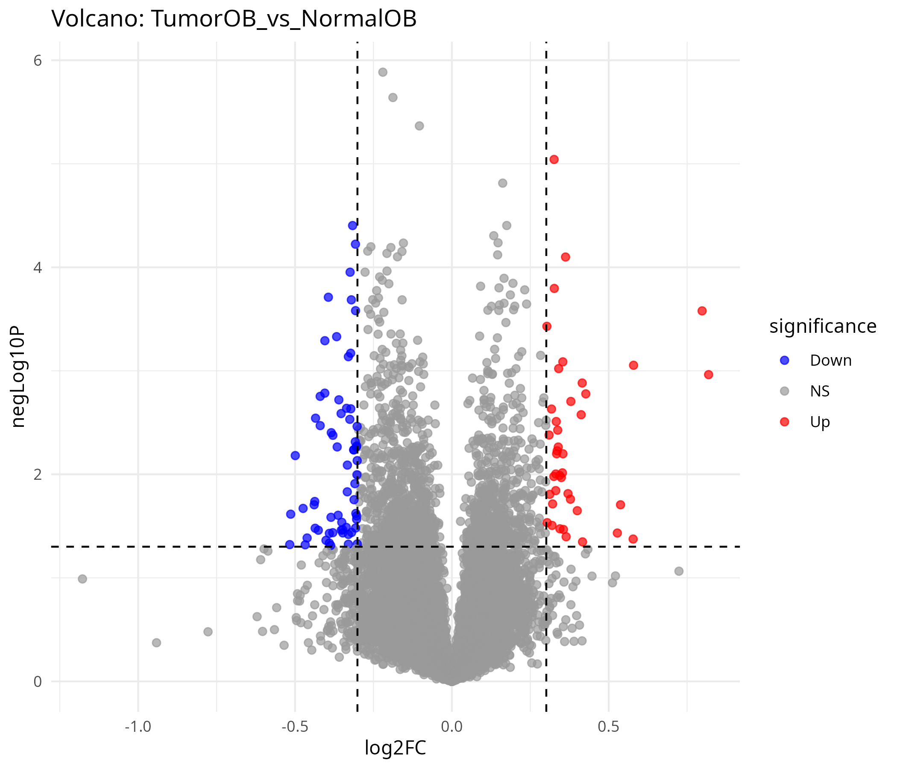
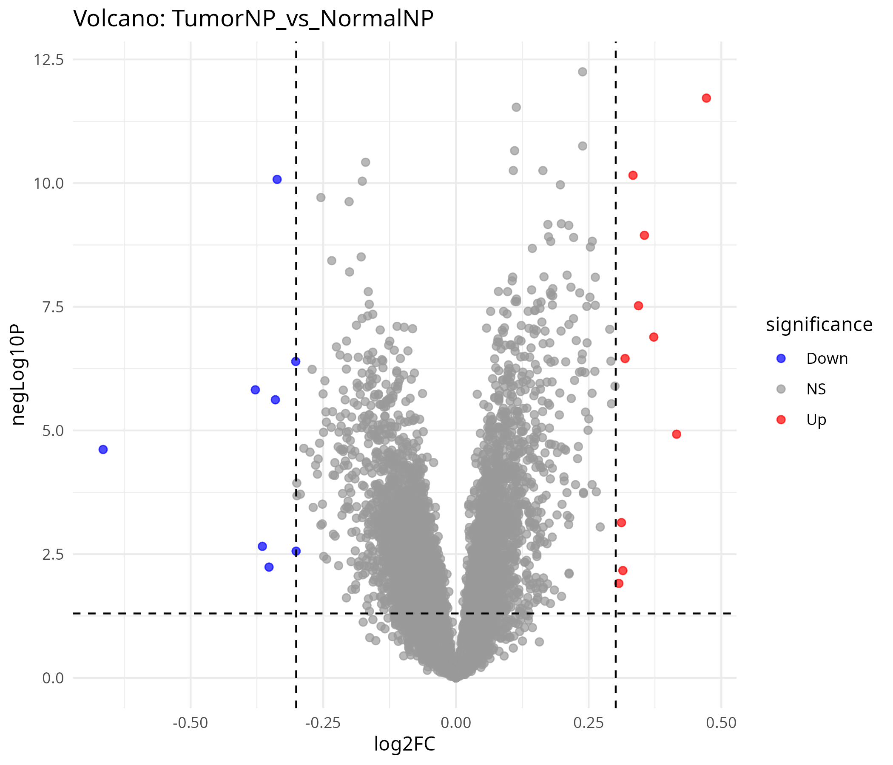
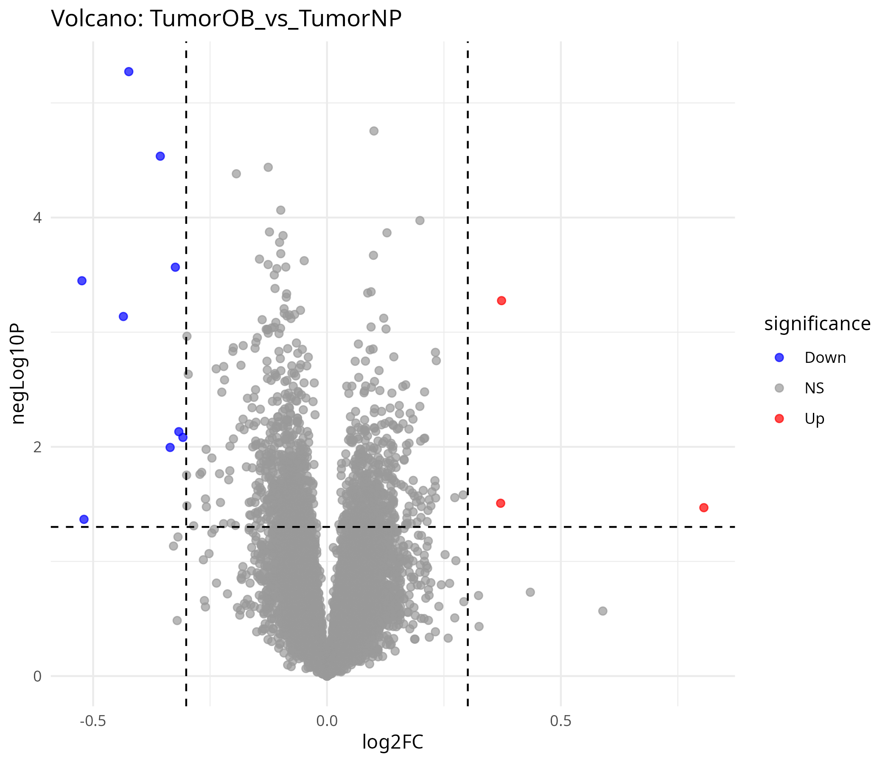
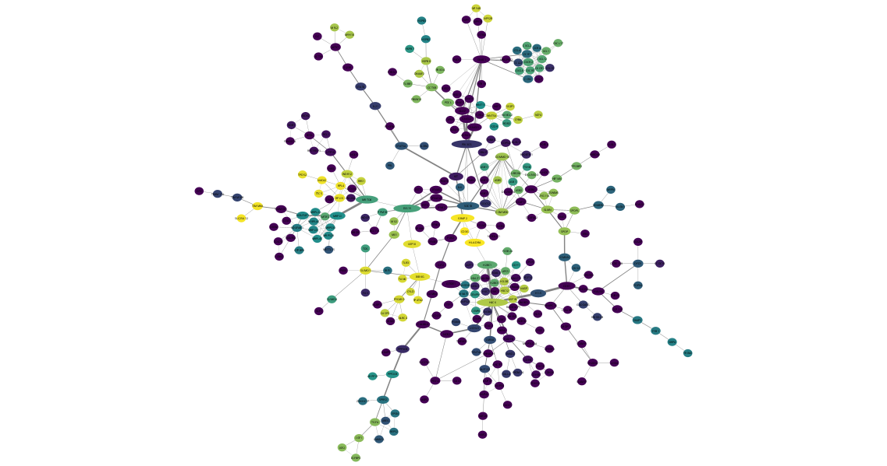
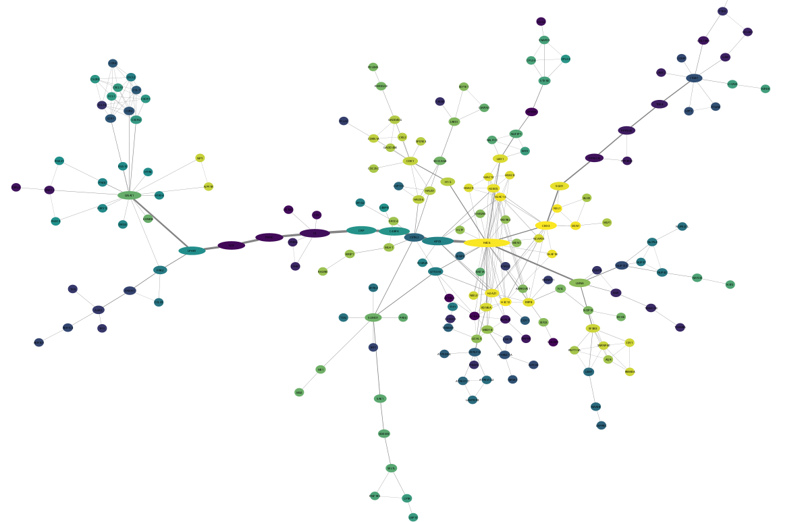
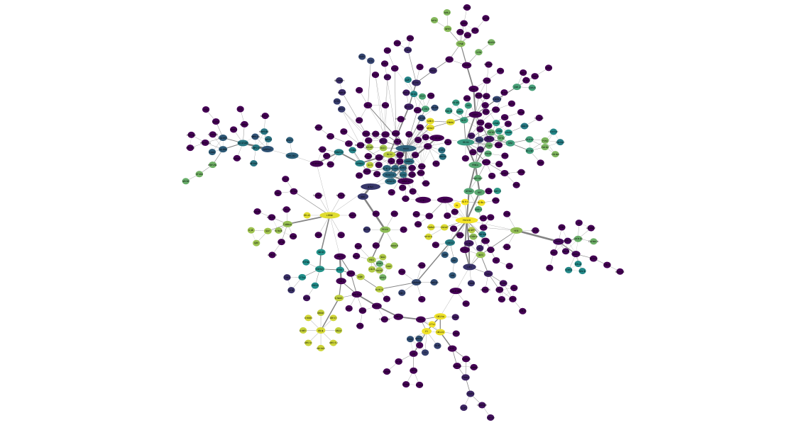
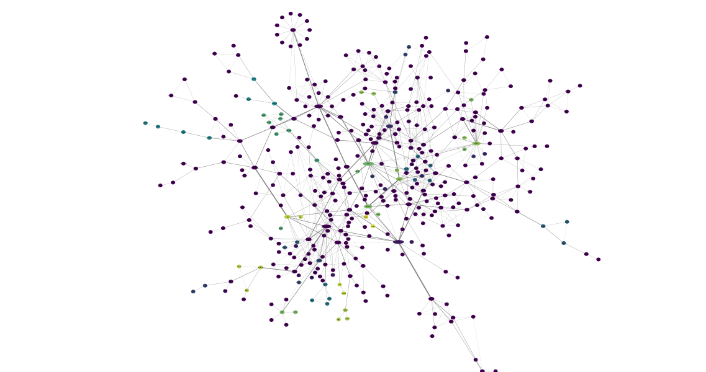
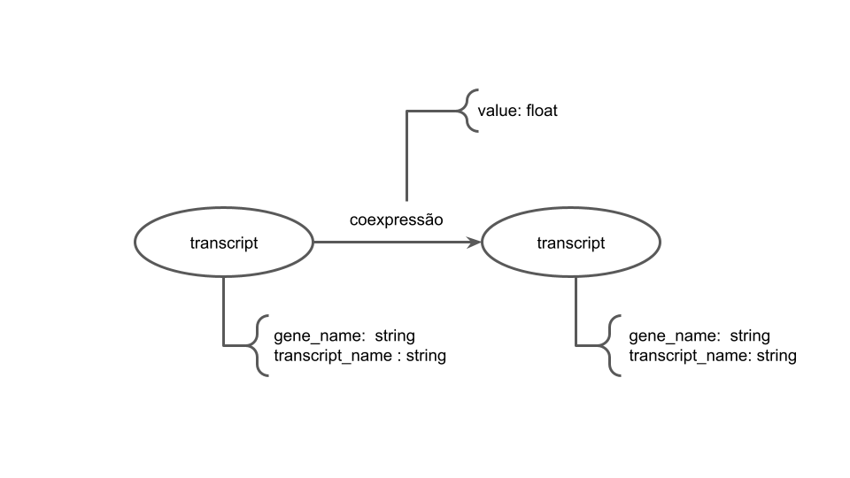

# Projeto `Clusters de coexpressão gênica em pacientes com câncer de próstata com e sem obesidade: impactos na progressão tumoral`
# Project `Gene Expression Clusters in Prostate Cancer Patients With and Without Obesity: Impacts on Tumor Progression`

project 3 

# Descrição Resumida do Projeto

A obesidade é uma condição metabólica caracterizada pelo acúmulo excessivo de gordura corporal, especialmente a visceral, e está associada a inflamação crônica, alterações hormonais e disfunções metabólicas. Essa condição tem se tornado um dos maiores problemas de saúde pública no mundo, com projeções de crescimento alarmantes nas próximas décadas.

O câncer de próstata, por sua vez, é o tumor maligno mais frequente em homens no Brasil depois do câncer de pele não melanoma e apresenta elevada taxa de mortalidade. O desenvolvimento e a progressão da doença envolvem múltiplos fatores de risco, incluindo idade, hereditariedade, dieta e estilo de vida.

Diversos estudos indicam que a obesidade influencia negativamente a biologia tumoral da próstata, promovendo maior agressividade, risco de recidiva e mortalidade específica. Esse efeito ocorre por meio da liberação de adipocinas inflamatórias, alterações na sinalização hormonal (como o aumento da aromatização da testosterona em estradiol) e modificações no microambiente tumoral.

A proposta deste projeto é analisar dados de expressão gênica de pacientes com câncer de próstata obesos e não obesos, construindo redes de coexpressão para identificar clusters de genes, hubs e vias biológicas associadas à progressão tumoral. Essa abordagem permitirá compreender como a obesidade reprograma o transcriptoma prostático.

# Slides

[Slides PDF](https://github.com/datasciforhealth/datasci4health/blob/main/project1/assets/slides/Slides%20Clusters%20de%20express%C3%A3o%20g%C3%AAnica%20em%20pacientes%20com%20c%C3%A2ncer%20de%20pr%C3%B3stata%20com%20e%20sem%20obesidade%20impactos%20na%20progress%C3%A3o%20tumoral%20presentacao.pdf)

# Fundamentação Teórica

- O câncer de próstata (CaP) é a neoplasia mais incidente em homens no Brasil, apresentando fatores de risco como idade, histórico familiar e etnia (INCA, 2022) [[1]](#1).  
- Evidências recentes indicam que a obesidade é um importante modulador da progressão do CaP, associada a tumores mais agressivos e maior mortalidade (Avgerinos et al., 2019; Cao & Ma, 2011) [[2]](#2), [[3]](#3).  
- A obesidade, além de alterar o metabolismo sistêmico, promove inflamação crônica e desregulação hormonal por meio da secreção de adipocinas, citocinas inflamatórias e do aumento da conversão de testosterona em estradiol no tecido adiposo (Liermann-Wooldrik et al., 2024) [[4]](#4). Esses mecanismos contribuem para a instabilidade genômica e maior agressividade tumoral.  

Portanto, investigar como a obesidade impacta o microambiente prostático por meio da análise da expressão gênica diferencial é fundamental para esclarecer os mecanismos envolvidos na progressão do CaP e apontar possíveis alvos para intervenção terapêutica.  

---

# Perguntas de Pesquisa

Quais genes são diferencialmente expressos entre tumores de pacientes com câncer de próstata obesos/sobrepeso e tumores de pacientes normopeso, e como os perfis de expressão destes genes se associam a parâmetros clínicos de progressão tumoral?

__Hipóteses__
- A obesidade altera o padrão de expressão gênica em tumores de pacientes com câncer de próstata, resultando em um conjunto distinto de genes diferencialmente expressos entre obesos/sobrepeso e normopeso.

- Os genes diferencialmente expressos em tumores de pacientes obesos/sobrepeso estarão enriquecidos em vias relacionadas à inflamação, ao metabolismo e ao remodelamento do microambiente tumoral.

- Um score de assinatura derivado dos genes diferencialmente expressos estará associado a pior prognóstico clínico (p. ex. maiores escores de Gleason, estádios mais avançados e menor sobrevida livre de progressão).

# Bases de Dados e Evolução

Base de Dados | Endereço na Web | Resumo descritivo
----- | ----- | -----
Gene Expression Omnibus (GEO) | https://www.ncbi.nlm.nih.gov/gds | Base pública do NCBI que armazena dados de expressão gênica e outros experimentos de alto rendimento, permitindo acesso a estudos de transcriptômica em diversas condições biológicas e doenças.

1. Os dados utilizados foram extraídos do estudo *Gene expression profiling of human prostate tumors identifies chromatin remodeling as a molecular link between obesity and lethal prostate cancer*. O accession number dos dataset com as amostras é GSE79021.
2. As amostras foram extraídas e criados quatro grupos. Dois grupos com tecido prostático tumoral de indivíduos obesos e não obesos, e outros dois grupos com teciso prostático saudável de indivíduos obesos e não obesos.
3. No grupo de controle normopeso foram extraídas 46 amostras e para o obeso 3 amostras, já para o grupo tumoral foram extraídas 143 amostras de indívíduos normo peso e 10 amostras para obesos.

Baseados no *dataset* utilizado foram identificadas variações de nível de expressão gênica siginificativas em diversos genes. Considerando os *tresholds* utilizado para o FoldChange em 0.30103 e para o p-valor 0.05, foram identificados as seguintes quantidades de genes siginificantes:

GRupos Analisados | Quantitativos de Genes *Upregulated* | Quantitativos de Genes *Downregulated*
----- | ----- | -----
Tumoral Normopeso x Normal Normopero | 10  | 8  
Tumoral Obeso x Normal Obeso | 41  | 64 
Tumoral Obeso x Tumoral Normopeso | 3  | 9  
Normal Obeso x Normla Normopeso | 12 | 27

Os gráficos de vulcão a seguir ilustram a comparção de diferença de expressão gênica para os diferentes grupos de expressão. A linha tracejada horizontal representa o *treshold* do pvalor e as linhas tracejadas na vertical os *tresholds* positivo e negativo do *FoldChange*.

## Normal Obeso x Normal Normopeso
> 

## Tumoral Normopeso x Normal Normopeso
> 

## Tumoral Obeso x Normal Obeso
> 

## Tumoral Obeso x Normal Normopeso
> 

Os grafos apresentam a maior sub-rede extraída da rede original de interações dos respectibos grupos de diferencial de expressão gênica. Essa sub-rede teve a cor dos nós alteradas conforme as comunidades Leiden identificadas, os resultados são representados pela coloração que varia do amarelo ao roxo, em um gradiente contínuo que reflete os diferentes clusters formados.

O tamanho e o alongamento dos nós estão proporcionais ao valor de Betweenness Centrality, indicando a importância topológica de cada gene (ou proteína) como intermediário no fluxo de informação dentro da rede. Assim, nós mais alongados correspondem a vértices que desempenham papel de pontes entre diferentes regiões da rede, sendo potenciais nós-chave de comunicação entre módulos funcionais.

Observando-se as arestas, a espessura está associada ao parâmetro Edge Betweenness, que quantifica o número de caminhos mais curtos que passam por uma determinada aresta. Desse modo, arestas mais espessas indicam interações críticas para a conectividade geral da rede, represe# Projeto `Clusters de coexpressão gênica em pacientes com câncer de próstata com e sem obesidade: impactos na progressão tumoral`
# Project `Gene Expression Clusters in Prostate Cancer Patients With and Without Obesity: Impacts on Tumor Progression`

Para a execução do arquivo .cys é necessária a instalação do software cytoscape com as extensões clusterMaker2 (v.2.3.4) e CytoNCA (v.2.1.6). O arquivo de extensão .ows é originário do software Orange, sendo necessário para sua excução a instalação dos plugins biosci e Bioinformatics.
ntando potenciais rotas preferenciais de comunicação entre clusters distintos.

Visualmente, é possível observar que a sub-rede contém regiões centrais altamente conectadas, com maior densidade de nós e arestas, além de módulos periféricos mais esparsos. Esses padrões refletem a estrutura modular típica de redes biológicas, nas quais poucos nós de alta centralidade conectam grupos funcionalmente correlacionados.

## Normal Obeso x Normal Normopeso
> 

## Tumoral Obeso x Normal Obeso
> 

## Tumoral Obeso x Tumoral Normopeso
> 

## Tumoral Normopeso x Normal Normopeso
> 

# Modelo Lógico

> 

# Integração entre Bases
Em função do trabalho estar relacionado a um tema pouco explorado, a disponibilidade de estudos e datasets que envolvem cancer de próstata e índice de massa corpórea é bastante limitada. Como parte do trabalho para a etapa final o grupo irá investigar a disponiblidade de dados em novas fontes. Uma última alternativa seria, a partir da base de dados disponível até o momento com dados de índice de massa corpórea, sintetizar os dados faltantes para fins didáticos a partir de algum algoritmo de machine learning.

# Análise Preliminar
A análise comparativa entre os diferentes grupos experimentais revelou assinaturas moleculares distintas associadas tanto ao estado tumoral quanto à obesidade, evidenciando interações contextuais entre metabolismo, sinalização celular e progressão tumoral.

Nos contrastes envolvendo tecidos tumorais (TumorNP vs NormalNP e TumorOB vs TumorNP), observou-se a conservação de genes hub centrais como PIK3CB, ITGB3 e RBBP4, os quais participam de módulos críticos de sinalização e regulação epigenética. A manutenção desses hubs sugere uma arquitetura de rede estável relacionada à progressão tumoral, independente da condição metabólica, reforçando o papel de vias como PI3K/AKT, adesão celular e modificações de histonas na sobrevivência e proliferação das células prostáticas.

Por outro lado, os contrastes envolvendo tecidos normais (NormalOB vs NormalNP) apresentaram predominância de genes estruturais da matriz extracelular, como COL1A1, COL3A1 e COL4A1, além de VCAN, indicando que a obesidade induz uma remodelação tecidual associada ao microambiente prostático, possivelmente favorecendo processos pró-tumorais.

A análise funcional pelo DAVID destacou o gene BMP5 como um dos principais reguladores diferencialmente expressos entre os grupos tumorais (TumorOB vs TumorNP). Esse gene, associado às vias Hippo, TGF-β e Wnt, está envolvido na regulação do crescimento e apoptose celular, e sua desregulação pode promover a progressão do câncer de próstata ao aumentar a proliferação e reduzir a morte celular.

De modo geral, os achados indicam que:
As diferenças tumorais predominam sobre os efeitos da obesidade, mas esta modula o contexto molecular do tecido normal, potencialmente alterando o microambiente prostático.

As vias metabólicas e relacionadas ao câncer foram as mais frequentes entre os genes compartilhados, sugerindo um elo direto entre metabolismo e progressão tumoral.

Não houve sobreposição de genes entre tecidos normais e tumorais (num contexto OBvsNP), reforçando a natureza dependente do contexto tecidual na resposta à obesidade.

Esses resultados sugerem uma possível influência de fatores metabólicos na modulação de vias relacionadas ao câncer de próstata, mas sem evidências suficientes para estabelecer uma relação causal direta. O gene BMP5 e os hubs identificados (PIK3CB, ITGB3 e RBBP4) podem representar pontos de interesse para análises futuras, considerando suas funções em sinalização celular e regulação epigenética. No entanto, são necessários estudos adicionais para confirmar se essas alterações têm papel funcional relevante na interface entre obesidade e progressão tumoral prostática.

# Metodologia
1. Para  obtenção dos dados serão utilizados datasets públicos de expressão gênica disponíveis em repositórios internacionais como TCGA (PRAD), GEO e cBioPortal, que reúnem dados moleculares e clínicos de pacientes com câncer de próstata.
2. Pré-processamento e controle de qualidade:
* Filtragem dos dados de expressão.
* Remoção de genes com baixa expressão.
3. Análise de expressão diferencial (DEG)
* Realizada no RStudio, comparando os grupos obesos vs. não obesos.
* Identificação de genes diferencialmente expressos.
* Construção de gráficos para visualizar a distribuição dos DEGs.
4. Análise funcional e enriquecimento de vias
* O objetivo é identificar processos biológicos e vias moleculares associados à obesidade e à progressão do câncer de próstata (inflamação, metabolismo, sinalização hormonal).
5. Construção de redes de interação e identificação de genes-chave.
* Análise da topologia da rede em Cytoscape para determinar genes centrais e clusters de coexpressão relevantes.
* Seleção de genes candidatos para validação posterior.
6. Validação clínica no TCGA

# Ferramentas
- Cytoscape
- RStudio
- STRING
# Referências Bibliográficas

<a id="1">[1]</a> INCA. Instituto Nacional de Câncer. *Estimativa 2022: Incidência de Câncer no Brasil*. Rio de Janeiro: INCA; 2022. Disponível em: [https://www.inca.gov.br](https://www.inca.gov.br)  

<a id="2">[2]</a> Avgerinos KI, Spyrou N, Mantzoros CS, Dalamaga M. Obesity and cancer risk: Emerging biological mechanisms and perspectives. *Metabolism*. 2019;92:121-135. [https://doi.org/10.1016/j.metabol.2018.11.001](https://doi.org/10.1016/j.metabol.2018.11.001)  

<a id="3">[3]</a> Cao Y, Ma J. Body mass index, prostate cancer–specific mortality, and biochemical recurrence: a systematic review and meta-analysis. *Cancer Prev Res*. 2011;4(4):486-501. [https://doi.org/10.1158/1940-6207.CAPR-10-0229](https://doi.org/10.1158/1940-6207.CAPR-10-0229)  

<a id="4">[4]</a> Liermann-Wooldrik C, et al. Obesity-driven mechanisms in prostate cancer progression. *Front Oncol*. 2024;14. [https://doi.org/10.3390/ijms252212137] 
